## 8. Batch Processing Patterns

Batch processing is a fundamental approach in data engineering where data is collected over time and processed as a batch. Spark excels at batch processing, and several common patterns have emerged as best practices in the industry.

```mermaid
flowchart TD
    Batch["Batch Processing Patterns"] --> Incr["Incremental Processing"]
    Batch --> Window["Windowed Processing"]
    Batch --> Partition["Partitioning Strategies"]
    Batch --> Error["Error Handling"]
    
    Incr --> I1["Full Refresh"] 
    Incr --> I2["Incremental Updates"] 
    Incr --> I3["Change Data Capture"] 
    
    Window --> W1["Time Windows"] 
    Window --> W2["Sliding Windows"] 
    Window --> W3["Session Windows"] 
    
    Partition --> P1["Hash Partitioning"] 
    Partition --> P2["Range Partitioning"] 
    Partition --> P3["Dynamic Partitioning"] 
    
    Error --> E1["Exception Handling"] 
    Error --> E2["Data Quality Checks"] 
    Error --> E3["Dead Letter Queue"] 
    
    style Batch fill:#f5d6c0,stroke:#333,stroke-width:2px
    style Incr fill:#d1e7dd,stroke:#333,stroke-width:2px
    style Window fill:#ffefc0,stroke:#333,stroke-width:2px
    style Partition fill:#c0e8f5,stroke:#333,stroke-width:2px
    style Error fill:#e7d1dd,stroke:#333,stroke-width:2px
```



### 8.1 Incremental Processing

Incremental processing is a pattern where only new or modified data is processed in each batch run, rather than processing the entire dataset every time. This approach can significantly improve efficiency for large datasets.

#### Full Refresh vs. Incremental Updates

```python
from pyspark.sql.functions import current_timestamp, lit, col

# Sample source data (imagine this is a snapshot of a data source)
source_data = [
    (1, "Product A", 10.0, "2023-01-15 10:00:00"),
    (2, "Product B", 20.0, "2023-01-15 11:00:00"),
    (3, "Product C", 30.0, "2023-01-15 12:00:00")
]

source_df = spark.createDataFrame(
    source_data, 
    ["id", "name", "price", "last_updated"]
)

# Save this as our "current state"
source_df.write.mode("overwrite").saveAsTable("products_current")

# Approach 1: Full Refresh Pattern
def full_refresh_process():
    """Process all data and replace the target completely."""
    # Read the entire source data
    source = spark.table("products_current")
    
    # Apply transformations
    transformed = source.withColumn("price_with_tax", col("price") * 1.1)
    
    # Write to target, overwriting existing data
    transformed.write.mode("overwrite").saveAsTable("products_processed")
    
    print("Full refresh completed")

# Approach 2: Incremental Update Pattern
def incremental_process(checkpoint_time):
    """Process only new or modified data since the last checkpoint."""
    # Read only new/modified records
    source = spark.table("products_current")
    new_records = source.filter(col("last_updated") > checkpoint_time)
    
    if new_records.count() == 0:
        print("No new data to process")
        return current_timestamp().cast("string")
    
    # Apply transformations
    transformed = new_records.withColumn("price_with_tax", col("price") * 1.1)
    
    # Merge with existing target data
    if spark.catalog.tableExists("products_processed"):
        # Append new records
        transformed.write.mode("append").saveAsTable("products_processed")
    else:
        # Create table if it doesn't exist
        transformed.write.mode("overwrite").saveAsTable("products_processed")
    
    # Return new checkpoint time
    return current_timestamp().cast("string")

# Simulate incremental processing
# 1. Initial load
checkpoint_time = "2023-01-01 00:00:00"
checkpoint_time = incremental_process(checkpoint_time)

# 2. Add new data to source
new_data = [
    (4, "Product D", 40.0, "2023-01-16 09:00:00"),
    (5, "Product E", 50.0, "2023-01-16 10:00:00")
]

new_df = spark.createDataFrame(
    new_data, 
    ["id", "name", "price", "last_updated"]
)

# Append to source
new_df.write.mode("append").saveAsTable("products_current")

# 3. Run incremental process again
checkpoint_time = incremental_process(checkpoint_time)

# Check results
result = spark.table("products_processed")
result.show()
```

#### Change Data Capture (CDC)

Change Data Capture is a more sophisticated incremental processing pattern that tracks all changes (inserts, updates, deletes) to source data.

```python
from pyspark.sql.functions import current_timestamp, lit, col, when

# Sample CDC data with operation type
cdc_data = [
    (1, "Product A", 10.0, "2023-01-16 09:00:00", "INSERT"),
    (2, "Product B", 25.0, "2023-01-16 10:00:00", "UPDATE"),  # Price changed
    (3, "Product C", 30.0, "2023-01-16 11:00:00", "DELETE")
]

cdc_df = spark.createDataFrame(
    cdc_data, 
    ["id", "name", "price", "operation_time", "operation_type"]
)

# Function to apply CDC changes to a target table
def apply_cdc_changes(cdc_data, target_table):
    """Apply CDC changes to target table using merge/upsert pattern."""
    # Check if target exists
    if not spark.catalog.tableExists(target_table):
        # Create target with only INSERTs if it doesn't exist
        inserts = cdc_data.filter(col("operation_type") == "INSERT")
        if inserts.count() > 0:
            inserts.drop("operation_type", "operation_time") \
                  .write.mode("overwrite").saveAsTable(target_table)
        return
    
    # Get current target data
    target = spark.table(target_table)
    
    # Process each operation type
    # 1. Process DELETEs
    deletes = cdc_data.filter(col("operation_type") == "DELETE").select("id")
    if deletes.count() > 0:
        # Remove deleted records
        target = target.join(deletes, "id", "left_anti")
    
    # 2. Process UPSERTs (INSERT and UPDATE)
    upserts = cdc_data.filter(col("operation_type").isin("INSERT", "UPDATE")) \
                     .drop("operation_type", "operation_time")
    
    if upserts.count() > 0:
        # Remove records that will be updated
        target = target.join(upserts.select("id"), "id", "left_anti")
        # Add new and updated records
        target = target.union(upserts)
    
    # Write back to target
    target.write.mode("overwrite").saveAsTable(target_table)

# Apply CDC changes
apply_cdc_changes(cdc_df, "products_target")

# Check results
result = spark.table("products_target")
result.show()
```

### 8.2 Windowed Processing

Windowed processing is a pattern where data is processed in defined time windows, allowing for time-based analysis and aggregations.

```python
from pyspark.sql.functions import window, col, sum, avg, count, to_timestamp
from pyspark.sql.window import Window

# Sample time-series data
time_data = [
    ("2023-01-01 08:30:00", "sensor1", 25.0),
    ("2023-01-01 08:45:00", "sensor1", 26.0),
    ("2023-01-01 09:00:00", "sensor1", 27.0),
    ("2023-01-01 09:15:00", "sensor1", 28.0),
    ("2023-01-01 09:30:00", "sensor1", 29.0),
    ("2023-01-01 08:30:00", "sensor2", 20.0),
    ("2023-01-01 08:45:00", "sensor2", 21.0),
    ("2023-01-01 09:00:00", "sensor2", 22.0),
    ("2023-01-01 09:15:00", "sensor2", 23.0),
    ("2023-01-01 09:30:00", "sensor2", 24.0)
]

time_df = spark.createDataFrame(
    time_data, 
    ["timestamp", "sensor_id", "temperature"]
)

# Convert string timestamp to actual timestamp
time_df = time_df.withColumn(
    "timestamp", 
    to_timestamp(col("timestamp"), "yyyy-MM-dd HH:mm:ss")
)

# 1. Tumbling Window (fixed, non-overlapping windows)
tumbling_windows = time_df.groupBy(
    window(col("timestamp"), "30 minutes"),
    "sensor_id"
).agg(
    avg("temperature").alias("avg_temp"),
    count("*").alias("reading_count")
).select(
    col("window.start").alias("window_start"),
    col("window.end").alias("window_end"),
    "sensor_id",
    "avg_temp",
    "reading_count"
)

tumbling_windows.show()

# 2. Sliding Window (overlapping windows)
sliding_windows = time_df.groupBy(
    window(col("timestamp"), "30 minutes", "15 minutes"),  # 30-min window, sliding every 15 min
    "sensor_id"
).agg(
    avg("temperature").alias("avg_temp"),
    count("*").alias("reading_count")
).select(
    col("window.start").alias("window_start"),
    col("window.end").alias("window_end"),
    "sensor_id",
    "avg_temp",
    "reading_count"
)

sliding_windows.show()

# 3. Rolling Window (window function based)
window_spec = Window.partitionBy("sensor_id") \
                   .orderBy("timestamp") \
                   .rangeBetween(-30 * 60, 0)  # 30 minutes back from current row

rolling_df = time_df.withColumn(
    "rolling_avg_temp", 
    avg("temperature").over(window_spec)
).withColumn(
    "readings_in_window", 
    count("*").over(window_spec)
)

rolling_df.show()
```

### 8.3 Partitioning Strategies

Effective partitioning is critical for Spark performance, especially for large datasets. The right partitioning strategy can significantly reduce processing time.

```python
from pyspark.sql.functions import year, month, dayofmonth, spark_partition_id, hash, col

# Sample large dataset (simulated)
large_data = spark.range(0, 1000000) \
    .withColumn("timestamp", expr("date_add(to_date('2023-01-01'), id % 365)")) \
    .withColumn("value", expr("rand() * 1000")) \
    .withColumn("category", expr("concat('category_', cast(id % 10 as string))"))

# 1. Default partitioning
print(f"Default number of partitions: {large_data.rdd.getNumPartitions()}")

# Check partition distribution
large_data.groupBy(spark_partition_id()).count().show()

# 2. Repartition by number (balancing load)
repartitioned_df = large_data.repartition(20)
print(f"After repartition: {repartitioned_df.rdd.getNumPartitions()}")

# 3. Repartition by column (co-locating related data)
repart_by_category = large_data.repartition("category")
repart_by_category.groupBy("category", spark_partition_id()).count().show()

# 4. Repartition by multiple columns
repart_by_time_category = large_data.repartition(
    year("timestamp"), month("timestamp"), "category"
)

# 5. Custom partitioning using hash function
from pyspark.sql.functions import hash

# Create a custom hash for partitioning
custom_hash_df = large_data.withColumn(
    "partition_key", 
    hash(col("category"), month("timestamp")) % 20
).repartition("partition_key")

# 6. Coalesce to reduce partitions (does not shuffle data unless necessary)
coalesced_df = large_data.coalesce(10)
print(f"After coalesce: {coalesced_df.rdd.getNumPartitions()}")
```

### 8.4 Error Handling and Resilience

Production-grade batch processing requires robust error handling to ensure reliability and data quality.

```python
from pyspark.sql.functions import col, expr, lit, when
import datetime

# Sample data with potential errors
error_data = [
    (1, "Alice", "25", "NY", "2023-01-15"),
    (2, "Bob", "invalid_age", "CA", "2023-01-16"),
    (3, "Charlie", "35", "TX", "invalid_date"),
    (4, "Diana", None, "FL", "2023-01-18"),
    (5, "Eve", "30", None, "2023-01-19")
]

error_df = spark.createDataFrame(
    error_data, 
    ["id", "name", "age_str", "state", "date_str"]
)

# 1. Basic Exception Handling
def safe_cast_to_int(df, column):
    """Safely cast a string column to integer, setting errors to null."""
    return df.withColumn(
        f"{column}_int",
        when(
            col(column).rlike("^\\d+$"),  # Check if string is numeric
            col(column).cast("int")
        ).otherwise(None)
    )

def safe_cast_to_date(df, column):
    """Safely cast a string column to date, setting errors to null."""
    return df.withColumn(
        f"{column}_parsed",
        when(
            col(column).rlike("^\d{4}-\d{2}-\d{2}$"),  # Basic date format check
            to_date(col(column), "yyyy-MM-dd")
        ).otherwise(None)
    )

# Apply safe transformations
processed_df = error_df
processed_df = safe_cast_to_int(processed_df, "age_str")
processed_df = safe_cast_to_date(processed_df, "date_str")

# 2. Dead Letter Queue Pattern
# Separate valid and invalid records
valid_records = processed_df.filter(
    col("age_str_int").isNotNull() & 
    col("date_str_parsed").isNotNull() & 
    col("state").isNotNull()
)

invalid_records = processed_df.filter(
    col("age_str_int").isNull() | 
    col("date_str_parsed").isNull() | 
    col("state").isNull()
).withColumn(
    "error_timestamp", 
    current_timestamp()
).withColumn(
    "error_reason",
    when(col("age_str_int").isNull(), "Invalid age")
    .when(col("date_str_parsed").isNull(), "Invalid date")
    .when(col("state").isNull(), "Missing state")
    .otherwise("Unknown error")
)

# Process valid records
valid_results = valid_records.select(
    "id", "name", "age_str_int", "state", "date_str_parsed"
)

# Store invalid records for later investigation
invalid_records.write.mode("append").saveAsTable("error_records")

# 3. Monitoring and Logging
# Collect processing statistics
processing_stats = spark.createDataFrame([
    ("total_records", processed_df.count()),
    ("valid_records", valid_records.count()),
    ("invalid_records", invalid_records.count()),
    ("processing_time", datetime.datetime.now().strftime("%Y-%m-%d %H:%M:%S"))
], ["metric", "value"])

# Log stats or write to monitoring table
processing_stats.show()
```

### 8.5 End-to-End Batch Processing Example

Let's put these patterns together in a complete end-to-end example of a batch processing job:

```python
from pyspark.sql import SparkSession
from pyspark.sql.functions import col, to_date, year, month, day, current_timestamp
from pyspark.sql.functions import when, lit, coalesce, count, sum, avg, max, min
import datetime

def batch_process(input_path, output_path, processing_date, checkpoint_path=None):
    """End-to-end batch processing job with best practices."""
    
    # Create or get SparkSession
    spark = SparkSession.builder \
        .appName("BatchProcessingJob") \
        .config("spark.sql.shuffle.partitions", "200") \
        .getOrCreate()
    
    try:
        # 1. Extract: Load data incrementally if checkpoint exists
        if checkpoint_path:
            try:
                # Try to read last checkpoint
                checkpoint_df = spark.read.parquet(checkpoint_path)
                last_processed_date = checkpoint_df.first()["last_processed_date"]
                print(f"Incremental processing from {last_processed_date}")
            except:
                # No checkpoint found, process everything
                last_processed_date = "1900-01-01"
                print("Full processing (no checkpoint found)")
        else:
            # No checkpoint requested, process everything
            last_processed_date = "1900-01-01"
            print("Full processing (no checkpoint requested)")
        
        # Read input data
        input_df = spark.read.parquet(input_path)
        
        # Filter for incremental processing
        if last_processed_date != "1900-01-01":
            input_df = input_df.filter(col("date") > last_processed_date)
        
        # Short-circuit if no new data
        if input_df.isEmpty():
            print("No new data to process")
            return
        
        # 2. Validate: Separate valid and invalid records
        validated_df = input_df.withColumn(
            "is_valid", 
            col("customer_id").isNotNull() & 
            col("product_id").isNotNull() & 
            col("amount").isNotNull() & 
            (col("amount") > 0)
        )
        
        valid_records = validated_df.filter(col("is_valid") == True)
        invalid_records = validated_df.filter(col("is_valid") == False) \
            .withColumn("error_time", current_timestamp()) \
            .withColumn("processing_date", lit(processing_date))
        
        # Write invalid records to "dead letter queue"
        if invalid_records.count() > 0:
            invalid_records.write.mode("append") \
                .partitionBy("processing_date") \
                .parquet(f"{output_path}/errors")
        
        # 3. Transform: Apply business logic
        transformed_df = valid_records \
            .withColumn("date", to_date(col("date"))) \
            .withColumn("year", year(col("date"))) \
            .withColumn("month", month(col("date"))) \
            .withColumn("day", day(col("date"))) \
            .withColumn("amount_with_tax", col("amount") * 1.1) \
            .withColumn("processing_timestamp", current_timestamp())
        
        # 4. Aggregate: Calculate business metrics
        daily_metrics = transformed_df.groupBy("date", "product_category") \
            .agg(
                count("*").alias("transaction_count"),
                sum("amount").alias("total_amount"),
                avg("amount").alias("avg_amount"),
                max("amount").alias("max_amount"),
                min("amount").alias("min_amount")
            )
        
        # 5. Load: Write results using partitioning
        # Detailed data
        transformed_df.write.mode("append") \
            .partitionBy("year", "month", "day") \
            .parquet(f"{output_path}/detailed")
        
        # Aggregated metrics
        daily_metrics.write.mode("append") \
            .partitionBy("date") \
            .parquet(f"{output_path}/metrics")
        
        # 6. Update checkpoint for incremental processing
        if checkpoint_path:
            max_date_processed = transformed_df.agg(max("date")).first()[0]
            checkpoint_data = [(max_date_processed, processing_date)]
            checkpoint_df = spark.createDataFrame(
                checkpoint_data, 
                ["last_processed_date", "processing_date"]
            )
            checkpoint_df.write.mode("overwrite").parquet(checkpoint_path)
        
        # 7. Collect and log processing statistics
        stats = [
            ("processing_date", processing_date),
            ("records_processed", transformed_df.count()),
            ("invalid_records", invalid_records.count()),
            ("latest_date_processed", str(max_date_processed)),
            ("processing_timestamp", datetime.datetime.now().isoformat())
        ]
        
        stats_df = spark.createDataFrame(stats, ["metric", "value"])
        stats_df.write.mode("append").parquet(f"{output_path}/stats")
        
        return stats_df
        
    except Exception as e:
        # Error handling
        print(f"Error in batch processing: {str(e)}")
        # Log the error
        error_df = spark.createDataFrame([
            (processing_date, str(e), datetime.datetime.now().isoformat())
        ], ["processing_date", "error", "timestamp"])
        error_df.write.mode("append").parquet(f"{output_path}/process_errors")
        raise e
    finally:
        # Clean up (optional)
        spark.stop()

# Example usage:
# batch_process(
#     input_path="/data/raw/sales",
#     output_path="/data/processed/sales",
#     processing_date="2023-01-20",
#     checkpoint_path="/data/checkpoints/sales"
# )
```

#### Knowledge Check

> **Question**: What are the key advantages of implementing the Dead Letter Queue pattern in batch processing?
> 
> **Answer**: The Dead Letter Queue pattern provides several advantages: 1) It allows the main processing flow to continue even when some records have errors, improving resilience; 2) It preserves invalid data for later analysis, troubleshooting, or reprocessing rather than simply discarding it; 3) It provides valuable feedback about data quality issues that can be addressed upstream; and 4) It helps maintain a complete audit trail of all data, including records that couldn't be processed normally.

## Chapter Summary

In this chapter, we've explored the fundamental concepts and techniques of data processing in Apache Spark. We covered the following key areas:

- **Spark Architecture**: We examined the components of Spark's distributed architecture, including the driver, executors, and cluster manager, understanding how they work together to process data at scale.

- **Spark Environment**: We learned how to configure and customize a Spark session for different workloads, understand various deployment models, and manage runtime parameters.

- **DataFrame Operations**: We explored creating, manipulating, and analyzing DataFrames, which are the primary abstraction for structured data processing in Spark.

- **Data Manipulation**: We covered a wide range of transformations, from basic operations to advanced techniques like aggregations, joins, and window functions.

- **Spark SQL**: We learned how to leverage SQL for data processing in Spark, creating temporary views, writing queries, and understanding query optimization.

- **Complex Data Types**: We worked with arrays, maps, structs, and nested schemas, which are essential for handling real-world, semi-structured data.

- **ETL Operations**: We implemented common Extract, Transform, Load patterns, focusing on data cleaning, validation, transformation, and loading techniques.

- **Batch Processing Patterns**: We examined patterns like incremental processing, windowed analysis, partitioning strategies, and error handling to build robust data pipelines.

These concepts and techniques form the foundation of data processing with Apache Spark. In the next chapter, we'll build on this knowledge to explore real-time data processing with Spark Structured Streaming.

## Review Questions

1. What is the primary difference between transformations and actions in Spark, and how does this relate to Spark's execution model?
   - A. Transformations modify data immediately, while actions create execution plans
   - B. Transformations create new RDDs/DataFrames, while actions trigger computation
   - C. Transformations run on the driver, while actions run on executors
   - D. Transformations work on DataFrames, while actions work on RDDs

2. Explain how partitioning affects Spark performance, and describe at least two different partitioning strategies you might use for different scenarios.

3. When implementing an ETL pipeline in Spark, what are some key considerations for handling data quality issues? Describe at least three techniques you could use.

4. Compare and contrast the full refresh and incremental update patterns for batch processing. Under what circumstances would you choose one over the other?

5. How can you optimize a join operation between a large DataFrame (1TB) and a small DataFrame (10MB) in Spark?

## Further Reading

- **Spark: The Definitive Guide** by Bill Chambers and Matei Zaharia: Comprehensive coverage of Spark fundamentals and advanced topics.

- **Learning Spark, 2nd Edition** by Jules Damji et al.: Updated guide covering modern Spark concepts with a focus on DataFrames and Spark SQL.

- **Apache Spark Documentation**: [https://spark.apache.org/docs/latest/](https://spark.apache.org/docs/latest/) - Official documentation with detailed API references and programming guides.

- **Databricks Blog**: [https://databricks.com/blog/category/engineering](https://databricks.com/blog/category/engineering) - Technical articles and best practices from the creators of Spark.
