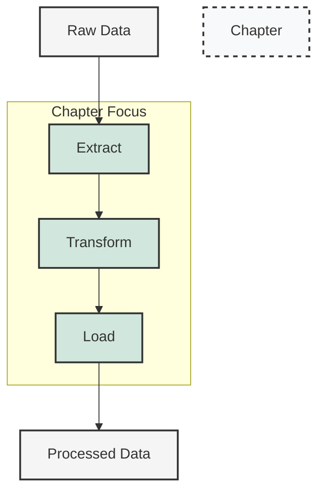

# Chapter 3: Data Processing

## Learning Objectives

By the end of this chapter, you will be able to:
- Explain the core architecture of Apache Spark and its role in big data processing
- Configure and customize a Spark session for different workloads
- Create and manipulate DataFrames using PySpark
- Apply transformations and actions to process data efficiently
- Execute SQL queries against Spark DataFrames
- Implement data processing patterns for common ETL scenarios
- Optimize Spark operations for better performance
- Handle complex data types and nested structures

## Key Terms

- **Apache Spark**: An open-source, distributed computing system for big data processing with in-memory caching and optimized query execution
- **PySpark**: The Python API for Apache Spark, enabling Python programmers to leverage Spark's capabilities
- **DataFrame**: A distributed collection of data organized into named columns, conceptually equivalent to a table in a relational database
- **Transformation**: A lazy operation on Spark DataFrames that creates a new DataFrame without modifying the original data
- **Action**: An operation that triggers computation and returns results to the driver program or writes data to external storage
- **Spark SQL**: A Spark module for structured data processing that provides a programming interface for SQL queries
- **Catalyst Optimizer**: Spark's query optimization engine that transforms and optimizes logical plans into physical execution plans
- **ETL (Extract, Transform, Load)**: The process of extracting data from source systems, transforming it to fit operational needs, and loading it into a target data store

## Introduction

Data processing is at the heart of any big data application. Whether you're cleaning messy datasets, joining information from disparate sources, aggregating metrics for business intelligence, or preparing features for machine learning, efficient and scalable data processing is essential. This chapter explores Apache Spark's powerful capabilities for processing data at scale using both programmatic interfaces and SQL.

Unlike traditional data processing systems that struggle with large datasets, Apache Spark is designed from the ground up to handle big data efficiently. Its distributed architecture, in-memory processing, and optimized execution engine make it possible to process terabytes of data across clusters of machines. Through PySpark, we can leverage these capabilities using Python, one of the most popular languages for data analysis.

In the previous chapter, we set up Databricks Community Edition, which provides a managed Spark environment. Now, we'll dive deeper into how Spark works and how to use it for various data processing tasks. We'll start with the fundamental concepts of Spark architecture and gradually progress to more advanced data manipulation techniques.

By the end of this chapter, you'll have a solid understanding of how to process data effectively using Apache Spark. You'll be able to write efficient PySpark code, leverage Spark SQL for declarative data processing, and implement common ETL patterns. These skills will form the foundation for more advanced topics in subsequent chapters, such as stream processing and machine learning.

Let's begin our journey into the world of distributed data processing with Apache Spark.
