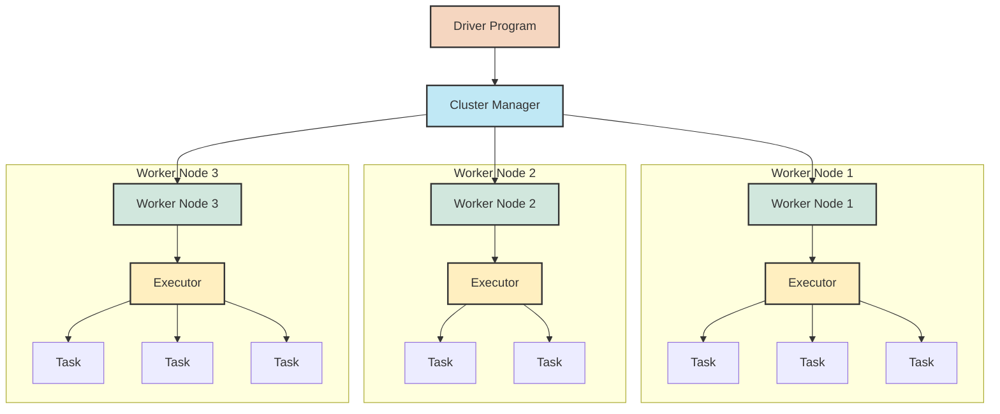
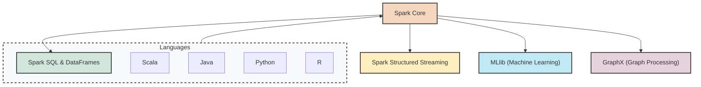
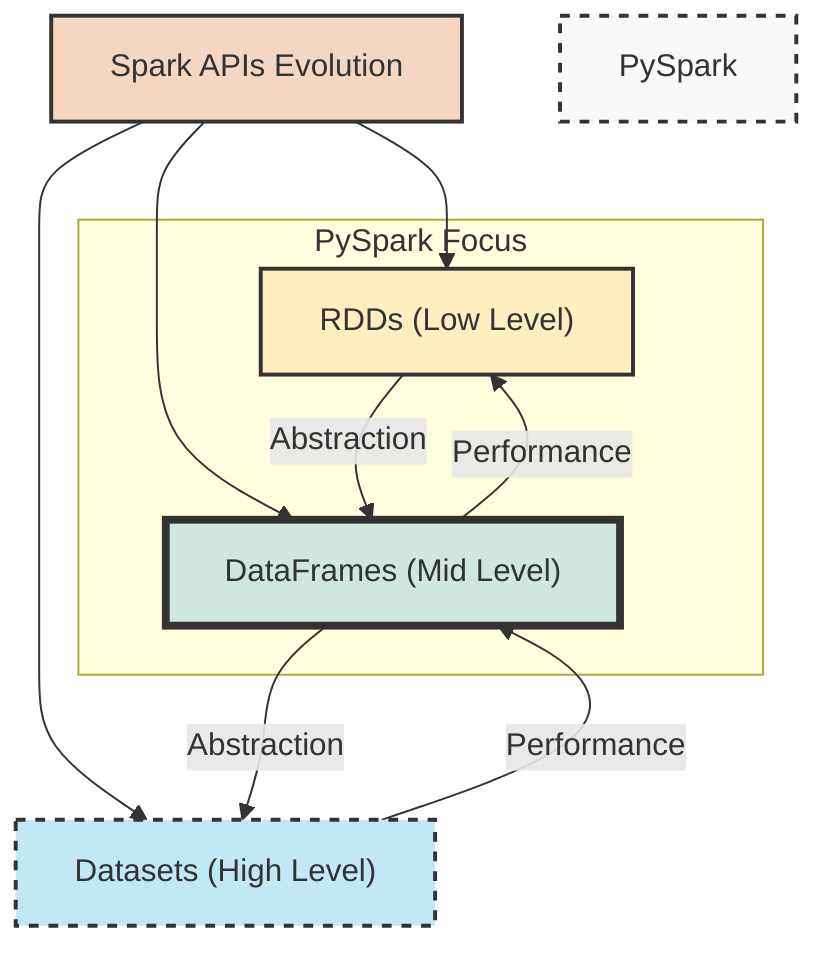
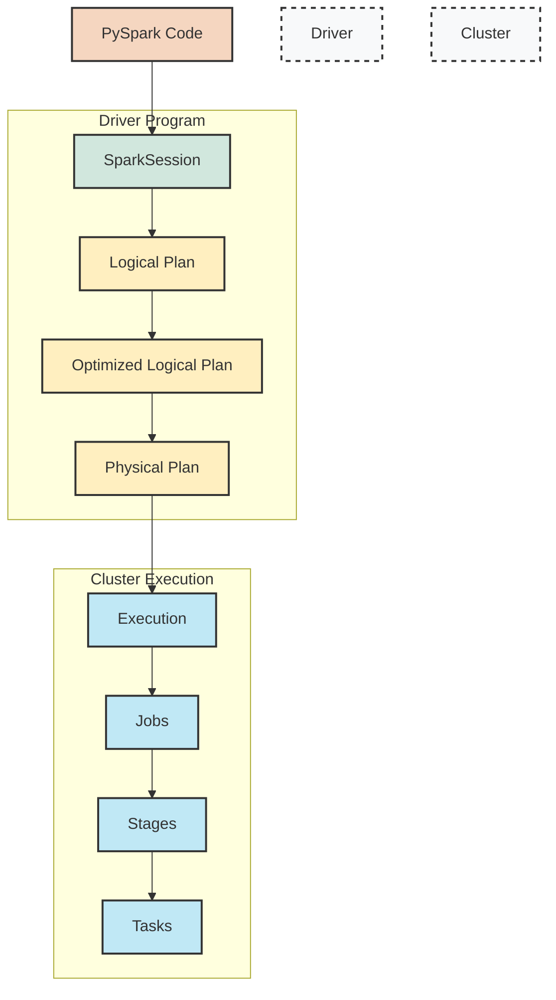
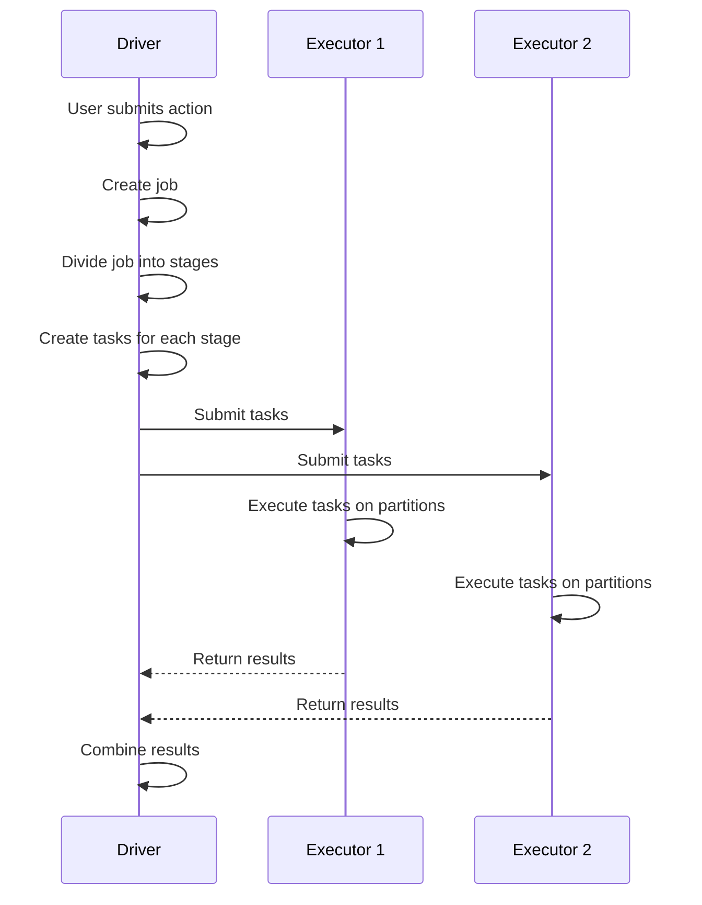

## 1. Introduction to Apache Spark

### 1.1 Spark Architecture Overview

Apache Spark is a unified analytics engine designed for large-scale data processing. To understand how Spark processes data efficiently, we must first examine its core architecture. Spark follows a master-worker architecture with a central coordinator (the driver) and distributed workers (executors) that perform parallel processing.



Let's examine the key components of this architecture:

1. **Driver Program**: The driver is the process where the main application runs, creating a SparkSession or SparkContext that coordinates the execution. It's responsible for:
   - Breaking down your application into tasks
   - Scheduling tasks on executors
   - Coordinating activity between executors
   - Collecting results from executors
   - Interacting with storage systems

2. **Cluster Manager**: The cluster manager allocates resources across the cluster. Spark supports several cluster managers:
   - Standalone Scheduler (Spark's built-in manager)
   - Apache Mesos
   - Hadoop YARN
   - Kubernetes
   
   In Databricks, the cluster manager is handled automatically for you.

3. **Worker Nodes**: These are machines in the cluster that run application code. Each worker node hosts one or more executors.

4. **Executors**: These are processes launched on worker nodes. Each executor:
   - Runs tasks (fundamental units of computation in Spark)
   - Maintains data in memory or disk storage
   - Returns results to the driver

5. **Tasks**: The smallest unit of work in Spark. The driver breaks down each operation into tasks that operate on a partition of data. These tasks run in parallel across the cluster.

#### Knowledge Check

> **Question**: What is the role of the driver in a Spark application?
> 
> **Answer**: The driver program controls the overall execution of the Spark application. It creates the SparkSession, breaks down operations into tasks, schedules these tasks on executors, and coordinates the overall execution across the cluster.

### 1.2 Spark Components and Ecosystem

Spark provides a unified platform for various data processing needs through its integrated components. Understanding these components helps you choose the right tools for specific data processing tasks.



1. **Spark Core**: The foundation of the entire project. It provides:
   - Distributed task dispatching
   - Scheduling
   - Basic I/O functionalities
   - The RDD (Resilient Distributed Dataset) API, which was the primary programming abstraction in early Spark versions

2. **Spark SQL and DataFrames**: A module for structured data processing that provides:
   - A DataFrame API that's similar to pandas but distributed
   - SQL interface for querying data
   - Optimized execution through the Catalyst optimizer
   - Seamless integration with various data sources

3. **Spark Structured Streaming**: An extension of the DataFrame API that enables:
   - Processing of continuous data streams
   - Unified API for batch and streaming
   - End-to-end exactly-once guarantees
   - Event-time processing

4. **MLlib (Machine Learning Library)**: A scalable machine learning library that includes:
   - Common learning algorithms for classification, regression, clustering, etc.
   - Feature extraction and transformation utilities
   - Model evaluation and tuning tools
   - Pipeline construction and management

5. **GraphX**: A library for graph computation and graph-parallel computation, providing:
   - A graph processing API
   - A collection of graph algorithms
   - Tools for building custom graph algorithms

All these components are designed to work together seamlessly, allowing you to combine different processing paradigms in a single application.

### 1.3 RDDs, DataFrames, and Datasets

Spark offers multiple APIs for distributed data processing, each with different levels of abstraction and optimization. Understanding these APIs helps you choose the right approach for your specific use case.



#### RDDs (Resilient Distributed Datasets)

RDDs were the original abstraction in Spark. They represent an immutable, distributed collection of objects that can be processed in parallel.

**Key characteristics of RDDs:**
- Low-level API with fine-grained control
- Type-safety at compile time (more relevant in Scala/Java)
- No built-in optimization engine
- Require explicit management of data schemas
- Support for custom partitioning and data placement

**Example of RDD operations:**

```python
# Creating and using RDDs
rdd = spark.sparkContext.parallelize([1, 2, 3, 4, 5])
rdd_squared = rdd.map(lambda x: x * x)
result = rdd_squared.collect()
print(result)  # [1, 4, 9, 16, 25]
```

#### DataFrames

DataFrames provide a higher-level abstraction built on top of RDDs. They represent distributed collections of data organized into named columns, similar to tables in a relational database.

**Key characteristics of DataFrames:**
- Schema-aware data organization
- Optimized execution through the Catalyst optimizer
- SQL query support
- Efficient memory usage with columnar storage
- APIs available in Python, Scala, Java, and R

**Example of DataFrame operations:**

```python
# Creating and using DataFrames
df = spark.createDataFrame([(1, "Alice", 25), (2, "Bob", 30), (3, "Charlie", 35)], 
                           ["id", "name", "age"])
filtered_df = df.filter(df.age > 25).select("id", "name")
filtered_df.show()
# +---+-------+
# | id|   name|
# +---+-------+
# |  2|    Bob|
# |  3|Charlie|
# +---+-------+
```

#### Datasets

Datasets are an extension of the DataFrame API that provides type-safety and object-oriented programming interface. They're primarily used in Scala and Java, as Python doesn't support the Dataset API due to its dynamic typing nature.

**Key characteristics of Datasets:**
- Type-safety at compile time
- Object-oriented programming interface
- Optimized execution through the Catalyst optimizer
- Encoder-based serialization/deserialization

> **Note**: In PySpark, you'll primarily work with DataFrames, as the Dataset API isn't available in Python. However, understanding the Dataset concept is useful when reading Spark documentation or working with JVM languages.

#### Knowledge Check

> **Question**: What are the main advantages of DataFrames over RDDs in Spark?
> 
> **Answer**: DataFrames offer schema awareness, optimized execution through the Catalyst optimizer, better memory efficiency with columnar storage, and SQL query support. These advantages typically result in better performance and simpler code compared to RDDs.

### 1.4 Spark Applications and Execution Model

Understanding how Spark executes applications is crucial for writing efficient code and troubleshooting performance issues. Let's explore the journey of a Spark application from code to execution.



#### Spark Application Lifecycle

1. **Application Submission**: When you submit a Spark application, a driver process is launched that runs your `main()` function.

2. **Resource Allocation**: The driver requests resources from the cluster manager to launch executors.

3. **Execution Planning**: 
   - When you perform operations on DataFrames, Spark builds a logical plan representing your data transformations.
   - The Catalyst optimizer transforms and optimizes this logical plan.
   - Spark converts the optimized logical plan into a physical plan with specific execution strategies.

4. **Task Execution**:
   - The driver breaks the physical plan into stages and tasks.
   - Tasks are distributed to executors for parallel execution.
   - Executors process their assigned data partitions and return results to the driver.

#### Key Execution Concepts

1. **Jobs**: A Spark job corresponds to a single action (like `collect()` or `count()`). Each job is broken down into stages that can be executed in parallel.

2. **Stages**: A stage is a set of tasks that can be executed without data movement (shuffling). Stages are separated by operations that require shuffling data across partitions, such as `groupBy()` or `join()`.

3. **Tasks**: Tasks are the smallest execution units in Spark. Each task processes data from a single partition and runs on a single executor core.

4. **Shuffle**: The process of redistributing data across partitions, often across nodes. Shuffles are expensive operations as they involve disk I/O, network I/O, and serialization.



#### Lazy Evaluation

One of the key concepts in Spark's execution model is lazy evaluation. Transformations on DataFrames (like `select()`, `filter()`, or `join()`) don't trigger computation immediately. Instead, they build up a lineage of operations that will be executed when an action (like `show()`, `collect()`, or `count()`) is called.

This approach allows Spark to:
- Optimize the entire chain of operations before execution
- Avoid unnecessary computations
- Combine multiple operations into efficient execution stages

**Example of lazy evaluation:**

```python
# These transformations build up the lineage but don't execute yet
df = spark.read.csv("data.csv", header=True, inferSchema=True)
filtered_df = df.filter(df.age > 25)
selected_df = filtered_df.select("name", "city")

# This action triggers the execution of all previous transformations
result = selected_df.collect()
```

#### Knowledge Check

> **Question**: Why is lazy evaluation beneficial in Spark?
> 
> **Answer**: Lazy evaluation allows Spark to optimize the entire chain of operations before execution, potentially combining multiple operations, eliminating unnecessary steps, and creating an efficient execution plan. This often results in significant performance improvements compared to eager evaluation.
