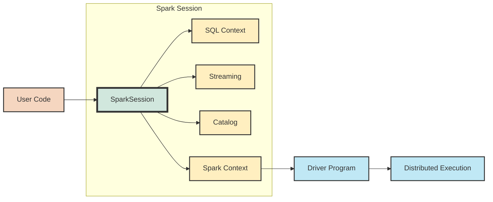
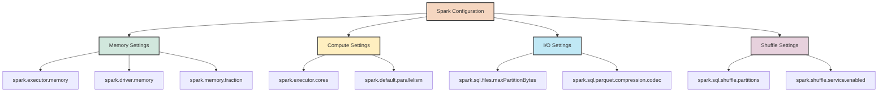
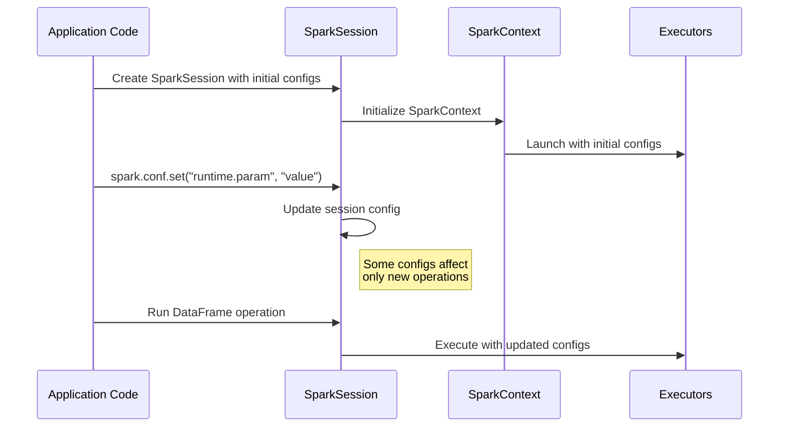
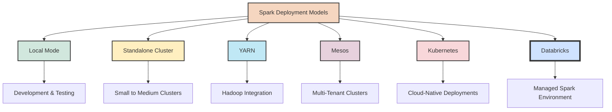

## 2. Setting Up the Spark Environment

### 2.1 SparkSession and Configuration

The `SparkSession` is the entry point to using Spark in Python. It provides a unified interface for interacting with Spark functionality and allows you to configure various aspects of your Spark application. In Databricks Community Edition, a SparkSession is automatically created for you, but understanding how to configure and customize it is important for optimizing your data processing tasks.



#### Creating a SparkSession

In Databricks, a SparkSession is already available as the variable `spark`. However, understanding how to create one from scratch is valuable for local development or custom configurations:

```python
from pyspark.sql import SparkSession

# Create a basic SparkSession
spark = SparkSession.builder \
    .appName("MySparkApplication") \
    .getOrCreate()

# Print the Spark version
print(f"Spark version: {spark.version}")
```

The `builder` pattern with method chaining makes it easy to configure various aspects of your SparkSession before creating it.

#### Configuring SparkSession

You can configure numerous parameters to optimize your Spark application for specific workloads:

```python
from pyspark.sql import SparkSession

# Create a more heavily configured SparkSession
spark = SparkSession.builder \
    .appName("ConfiguredSparkApp") \
    .config("spark.executor.memory", "4g") \
    .config("spark.executor.cores", "2") \
    .config("spark.sql.shuffle.partitions", "100") \
    .config("spark.sql.autoBroadcastJoinThreshold", "10m") \
    .getOrCreate()
```

#### Key Configuration Parameters

Here are some important configuration parameters that you might want to adjust:

1. **Memory Allocation**:
   - `spark.executor.memory`: Amount of memory to use per executor process
   - `spark.driver.memory`: Amount of memory to use for the driver process
   - `spark.memory.fraction`: Fraction of heap space used for execution and storage

2. **Concurrency**:
   - `spark.executor.cores`: Number of cores to use on each executor
   - `spark.default.parallelism`: Default number of partitions for RDDs
   - `spark.sql.shuffle.partitions`: Number of partitions for shuffled data

3. **Performance Tuning**:
   - `spark.sql.autoBroadcastJoinThreshold`: Maximum size for broadcast joins
   - `spark.sql.broadcastTimeout`: Timeout for broadcast joins
   - `spark.sql.adaptive.enabled`: Enable adaptive query execution

4. **I/O**:
   - `spark.sql.files.maxPartitionBytes`: Maximum partition size when reading files
   - `spark.sql.files.openCostInBytes`: Estimated cost to open a file



### 2.2 Managing SparkContext

The `SparkContext` is a lower-level entry point to Spark that was the primary interface in earlier Spark versions. In modern Spark applications using DataFrames, you typically interact with the `SparkSession` rather than directly with the `SparkContext`. However, understanding the SparkContext is still important, as it's responsible for the core functionality of connecting to the Spark cluster and creating RDDs.

When you create a SparkSession, a SparkContext is automatically created for you and can be accessed through the `spark.sparkContext` attribute:

```python
# Access the SparkContext from a SparkSession
sc = spark.sparkContext

# Check SparkContext configuration
print(f"Master: {sc.master}")
print(f"App ID: {sc.applicationId}")
print(f"App Name: {sc.appName}")
```

#### Common SparkContext Operations

```python
# Create an RDD from a Python collection
rdd = sc.parallelize([1, 2, 3, 4, 5])

# Create an RDD from a text file
lines_rdd = sc.textFile("path/to/textfile.txt")

# Set the log level
sc.setLogLevel("WARN")  # Options: ALL, DEBUG, ERROR, FATAL, INFO, OFF, TRACE, WARN

# Access configuration
config_value = sc.getConf().get("spark.executor.memory")
```

### 2.3 Setting Runtime Parameters

Sometimes you might want to adjust Spark parameters during the execution of your application rather than at initialization. This can be useful for tuning specific operations or implementing dynamic configuration based on data characteristics.

```python
# Set configuration at runtime
spark.conf.set("spark.sql.shuffle.partitions", 200)

# Get configuration value
current_partitions = spark.conf.get("spark.sql.shuffle.partitions")
print(f"Current shuffle partitions: {current_partitions}")

# Update multiple configurations
spark.conf.set("spark.executor.memory", "6g")
spark.conf.set("spark.dynamicAllocation.enabled", "true")
```

#### Session-Specific vs. Global Configuration

It's important to understand the difference between session-specific and global configuration:

1. **Session-specific configuration**: Changes made using `spark.conf.set()` affect only the current SparkSession and don't persist across applications.

2. **Global configuration**: Some Spark properties can only be set at SparkSession creation time and cannot be changed at runtime.



### 2.4 Application Deployment Models

When working with Spark, there are several deployment models to consider, each with advantages for different use cases:



1. **Local Mode**: Spark runs on a single machine, using threads to simulate a cluster. Ideal for development, testing, and small datasets.

   ```python
   # Create a local SparkSession
   spark_local = SparkSession.builder \
       .appName("LocalSparkApp") \
       .master("local[*]") \
       .getOrCreate()
   ```

2. **Standalone Cluster**: Spark's built-in cluster manager that provides a simple way to run Spark on a cluster.

   ```python
   # Connect to a standalone cluster
   spark_standalone = SparkSession.builder \
       .appName("StandaloneSparkApp") \
       .master("spark://master:7077") \
       .getOrCreate()
   ```

3. **YARN**: Hadoop's resource manager, which allows Spark to run alongside other workloads on a Hadoop cluster.

   ```python
   # Connect to YARN cluster (typically set through spark-submit)
   # spark-submit --master yarn --deploy-mode cluster app.py
   ```

4. **Mesos**: A general-purpose cluster manager that can run Spark and other applications.

   ```python
   # Connect to Mesos cluster
   spark_mesos = SparkSession.builder \
       .appName("MesosSparkApp") \
       .master("mesos://master:7077") \
       .getOrCreate()
   ```

5. **Kubernetes**: A container orchestration platform that can be used to deploy and manage Spark applications.

   ```python
   # Connect to Kubernetes cluster (typically set through spark-submit)
   # spark-submit --master k8s://https://kubernetes-master:443 ...
   ```

6. **Databricks**: A managed platform that provides an optimized Spark environment with additional features. 
   - You don't need to specify the master URL, as it's handled by the platform.
   - In Databricks Community Edition, a SparkSession is automatically created for you.

#### Knowledge Check

> **Question**: What are the key differences between creating a SparkSession in a standalone application versus using Databricks?
> 
> **Answer**: In a standalone application, you need to explicitly create a SparkSession, specify the master URL, and manage configurations manually. In Databricks, a SparkSession is automatically created for you, the cluster management is handled by the platform, and many optimizations are pre-configured. Additionally, Databricks provides a notebook environment integrated with the Spark session.
