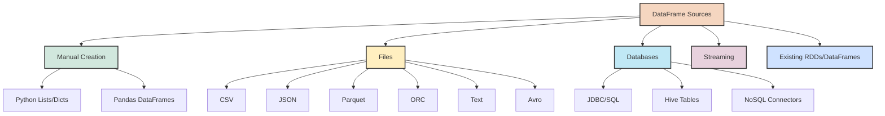
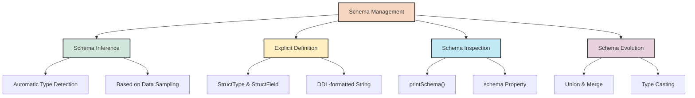
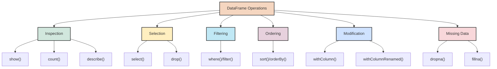

```mermaid
flowchart LR
    Raw["Raw Data"] --> Reader["DataFrame Reader"] --> Options["Reader Options"] --> Format["Data Format"] --> Schema["Schema Definition"] --> LoadExec["Load Execution"] --> DF["DataFrame"]
    
    style Raw fill:#f5d6c0,stroke:#333,stroke-width:2px
    style Reader fill:#d1e7dd,stroke:#333,stroke-width:2px
    style Options fill:#ffefc0,stroke:#333,stroke-width:2px
    style Format fill:#c0e8f5,stroke:#333,stroke-width:2px
    style Schema fill:#e7d1dd,stroke:#333,stroke-width:2px
    style LoadExec fill:#cfe2ff,stroke:#333,stroke-width:2px
    style DF fill:#d1e7dd,stroke:#333,stroke-width:2px,stroke-width:4px
```

## 3. Working with DataFrames

### 3.1 Creating DataFrames from Various Sources

DataFrames are the backbone of data processing in modern Spark applications. They provide a structured way to work with data, combining the best aspects of SQL tables and programming language collections. There are multiple ways to create DataFrames in PySpark, depending on your data source and requirements.



#### Creating DataFrames Manually

For small datasets or testing, you can create DataFrames directly from Python data structures:

```python
# From a list of tuples
data = [("Alice", 25), ("Bob", 30), ("Charlie", 35), ("Diana", 40)]
column_names = ["name", "age"]
df1 = spark.createDataFrame(data, column_names)
df1.show()

# From a list of dictionaries
data_dict = [
    {"name": "Alice", "age": 25, "city": "New York"},
    {"name": "Bob", "age": 30, "city": "San Francisco"},
    {"name": "Charlie", "age": 35, "city": "Seattle"}
]
df2 = spark.createDataFrame(data_dict)
df2.show()

# From a pandas DataFrame
import pandas as pd
pandas_df = pd.DataFrame({
    "id": [1, 2, 3],
    "name": ["Alice", "Bob", "Charlie"],
    "scores": [[85, 90], [95, 85], [75, 80]]
})
spark_df = spark.createDataFrame(pandas_df)
spark_df.show()
```

#### Reading Data from Files

Spark can read data from various file formats. The DataFrameReader interface, accessed via `spark.read`, provides a unified way to load data:

```python
# Reading CSV files
df_csv = spark.read.format("csv") \
    .option("header", "true") \
    .option("inferSchema", "true") \
    .load("path/to/data.csv")

# Alternative syntax for CSV
df_csv = spark.read.csv(
    "path/to/data.csv",
    header=True,
    inferSchema=True
)

# Reading JSON files
df_json = spark.read.json("path/to/data.json")

# Reading Parquet files (columnar format, highly efficient)
df_parquet = spark.read.parquet("path/to/data.parquet")

# Reading ORC files (optimized row columnar format)
df_orc = spark.read.orc("path/to/data.orc")

# Reading text files
df_text = spark.read.text("path/to/text.txt")
```

#### Reading from Databases

Spark can connect to various databases using JDBC or native connectors:

```python
# Reading from a JDBC source (e.g., MySQL, PostgreSQL)
df_jdbc = spark.read.format("jdbc") \
    .option("url", "jdbc:mysql://localhost:3306/database") \
    .option("dbtable", "users") \
    .option("user", "username") \
    .option("password", "password") \
    .load()

# Reading from Hive tables
spark.sql("USE my_database")
df_hive = spark.sql("SELECT * FROM my_table")
```

#### File Reading Best Practices

When reading files, consider these best practices for better performance and reliability:

1. **Specify Schema Explicitly**: While `inferSchema=True` is convenient, it requires an additional pass over the data. For large datasets or production code, define the schema explicitly:

   ```python
   from pyspark.sql.types import StructType, StructField, StringType, IntegerType
   
   # Define schema
   schema = StructType([
       StructField("id", IntegerType(), False),
       StructField("name", StringType(), True),
       StructField("age", IntegerType(), True),
       StructField("city", StringType(), True)
   ])
   
   # Read with explicit schema
   df = spark.read.csv("path/to/data.csv", header=True, schema=schema)
   ```

2. **Handle Data Quality Issues**: Use options to handle common data quality problems:

   ```python
   df = spark.read.csv(
       "path/to/data.csv",
       header=True,
       schema=schema,
       mode="DROPMALFORMED",  # Drop malformed lines
       nullValue="NA",       # Treat "NA" as null
       dateFormat="yyyy-MM-dd"  # Specify date format
   )
   ```

3. **Partitioned Data**: When reading from partitioned directories, you can leverage partitioning for better performance:

   ```python
   # Read partitioned data (e.g., data/year=2023/month=01/day=01/...)
   df = spark.read.parquet("path/to/partitioned/data")
   
   # Read only specific partitions
   df_subset = spark.read.parquet("path/to/data/year=2023/month=01")
   ```



#### Knowledge Check

> **Question**: What are the advantages of using an explicit schema when reading data into a DataFrame compared to using schema inference?
> 
> **Answer**: Using an explicit schema improves performance by eliminating the need for Spark to scan the data to infer types. It also provides more control over data types, helps catch data quality issues earlier, and ensures consistency across multiple data loads.

### 3.2 Schema Definition and Inference

The schema defines the structure of your DataFrame, including column names, data types, and nullable properties. Understanding schema management is crucial for working effectively with DataFrames.



#### Schema Inference

Spark can automatically infer the schema of your data by sampling a portion of it:

```python
# Schema inference with CSV
df = spark.read.option("inferSchema", "true").csv("data.csv", header=True)

# Schema is automatically inferred for JSON and Parquet
df_json = spark.read.json("data.json")
df_parquet = spark.read.parquet("data.parquet")
```

While convenient, schema inference has limitations:
- It requires an extra pass over the data, which can be expensive for large datasets
- Inferred types might not always match your expectations
- Type inference can be inconsistent if your data has mixed types or outliers

#### Explicit Schema Definition

Defining schemas explicitly gives you more control and better performance:

```python
from pyspark.sql.types import StructType, StructField, StringType, IntegerType, DoubleType, DateType

# Define schema using StructType and StructField
schema = StructType([
    StructField("id", IntegerType(), nullable=False),  # Non-nullable integer
    StructField("name", StringType(), nullable=True),  # Nullable string
    StructField("age", IntegerType(), nullable=True),
    StructField("salary", DoubleType(), nullable=True),
    StructField("hire_date", DateType(), nullable=True)
])

# Use the defined schema
df = spark.read.schema(schema).csv("data.csv", header=True)
```

Alternatively, you can define a schema using a DDL-formatted string, similar to SQL table definitions:

```python
# Define schema using a DDL string
schema_ddl = "id INT NOT NULL, name STRING, age INT, salary DOUBLE, hire_date DATE"

df = spark.read.schema(schema_ddl).csv("data.csv", header=True)
```

#### Inspecting Schema

To view the schema of an existing DataFrame:

```python
# Print schema in a tree format
df.printSchema()

# Access schema as an object
schema = df.schema
print(schema)

# Get field names and types programmatically
for field in df.schema.fields:
    print(f"Field name: {field.name}, Type: {field.dataType}, Nullable: {field.nullable}")
```

#### Data Types in Spark

Spark supports a rich set of data types, including primitive types and complex types:

```python
from pyspark.sql.types import *

# Primitive types
integer_field = StructField("count", IntegerType())
long_field = StructField("id", LongType())
float_field = StructField("weight", FloatType())
double_field = StructField("score", DoubleType())
string_field = StructField("name", StringType())
boolean_field = StructField("active", BooleanType())
date_field = StructField("created", DateType())
timestamp_field = StructField("updated", TimestampType())

# Complex types
array_field = StructField("tags", ArrayType(StringType()))
map_field = StructField("properties", MapType(StringType(), StringType()))

# Nested structure
address_struct = StructType([
    StructField("street", StringType()),
    StructField("city", StringType()),
    StructField("zipcode", StringType())
])
address_field = StructField("address", address_struct)
```

#### Schema Evolution

As your data evolves, you might need to handle schema changes:

```python
# Merging schemas (union of all fields)
df_combined = spark.read.option("mergeSchema", "true").parquet("directory_with_different_schemas/*")

# Adding columns
from pyspark.sql.functions import lit
df_with_new_column = df.withColumn("new_column", lit(None).cast(StringType()))

# Changing column types
from pyspark.sql.functions import col
df_with_changed_type = df.withColumn("amount", col("amount").cast(DoubleType()))
```

### 3.3 Basic DataFrame Operations

Once you have a DataFrame, you can perform various operations to explore, transform, and analyze your data. Let's look at the fundamental operations you'll use frequently.



#### Inspecting DataFrames

Before diving into transformations, it's often helpful to examine your data:

```python
# Display the first n rows
df.show()  # Default is 20 rows
df.show(5)  # Show 5 rows
df.show(10, False)  # Show 10 rows without truncating strings

# Get the number of rows
row_count = df.count()
print(f"DataFrame has {row_count} rows")

# Get basic statistics for numeric columns
df.describe().show()

# Show only the schema
df.printSchema()

# Display DataFrame as a pandas DataFrame (useful in notebooks for better formatting)
display(df.limit(10).toPandas())

# Preview the first few rows
df.head(5)  # Returns a list of Row objects

# Get column names
print(df.columns)
```

#### Selecting Columns

Often, you'll want to work with a subset of columns:

```python
# Select specific columns
df_selected = df.select("name", "age", "salary")

# Select columns with column expressions
from pyspark.sql.functions import col, expr
df_expr = df.select(
    col("name"),
    col("age") + 1,  # Compute age + 1
    expr("salary * 1.1")  # Using SQL expression to give 10% raise
)

# Select all columns
df_all = df.select("*")

# Select columns by position
df_pos = df.select(df.columns[0], df.columns[2])

# Drop columns
df_dropped = df.drop("address", "phone")

# Select nested fields (assuming address is a struct)
df_nested = df.select(
    "name",
    "age",
    "address.city",  # Select nested field
    "address.zipcode"
)
```

#### Filtering Rows

Filtering allows you to focus on specific subsets of your data:

```python
# Basic filtering
df_adults = df.filter(df.age >= 18)

# Alternative syntax
df_adults = df.filter("age >= 18")

# Multiple conditions
df_filtered = df.filter((df.age >= 18) & (df.age <= 65))

# Using SQL expressions
df_filtered = df.filter("age >= 18 AND age <= 65")

# Filter with OR
df_or = df.filter((df.city == "New York") | (df.city == "San Francisco"))

# Filter with IN
df_in = df.filter(df.city.isin("New York", "San Francisco", "Seattle"))

# Filter with LIKE
df_like = df.filter(df.name.like("%Smith%"))

# Filter null values
df_not_null = df.filter(df.email.isNotNull())
```

#### Sorting and Limiting

Ordering your data can be important for analysis or presentation:

```python
# Sort by a single column (ascending by default)
df_sorted = df.sort("age")

# Sort descending
from pyspark.sql.functions import desc
df_desc = df.sort(desc("age"))

# Sort by multiple columns
df_multi = df.sort("department", desc("salary"))

# Alternative orderBy syntax
df_ordered = df.orderBy("department", desc("salary"))

# Limit results
df_top_10 = df.sort(desc("salary")).limit(10)
```

#### Adding and Modifying Columns

Transforming your data often involves adding or modifying columns:

```python
# Add a constant column
from pyspark.sql.functions import lit
df_with_constant = df.withColumn("status", lit("Active"))

# Add a computed column
df_with_computed = df.withColumn("salary_monthly", df.salary / 12)

# Complex computation with expression
df_with_expr = df.withColumn("full_name", expr("concat(first_name, ' ', last_name)"))

# Update existing column
df_updated = df.withColumn("age", df.age + 1)  # Increment everyone's age

# Rename column
df_renamed = df.withColumnRenamed("salary", "annual_salary")

# Cast column to different type
df_casted = df.withColumn("salary", df.salary.cast("double"))
```

#### Handling Missing Data

Dealing with nulls and missing values is a common challenge in data processing:

```python
# Count null values in each column
from pyspark.sql.functions import count, when, isnan, col
df.select([count(when(isnan(c) | col(c).isNull(), c)).alias(c) for c in df.columns]).show()

# Drop rows with any null values
df_no_nulls = df.dropna()

# Drop rows if specific columns have nulls
df_no_null_names = df.dropna(subset=["name", "email"])

# Drop rows if all values are null
df_any_value = df.dropna(how="all")

# Fill null values with a constant
df_filled = df.fillna(0)  # Fill all numeric columns with 0

# Fill specific columns with different values
df_filled_specific = df.fillna({"age": 0, "name": "Unknown", "email": "no-email"})

# Fill null values with column statistics
from pyspark.sql.functions import mean
mean_age = df.select(mean(df.age)).first()[0]
df_filled_mean = df.fillna({"age": mean_age})
```

#### Knowledge Check

> **Question**: How would you filter a DataFrame to find rows where a person's age is between 25 and 35, and they live in either "New York" or "San Francisco"?
> 
> **Answer**: You could use:
> ```python
> df_filtered = df.filter((df.age >= 25) & (df.age <= 35) & df.city.isin("New York", "San Francisco"))
> 
> # Or using SQL expression style:
> df_filtered = df.filter("age >= 25 AND age <= 35 AND city IN ('New York', 'San Francisco')")
> ```
