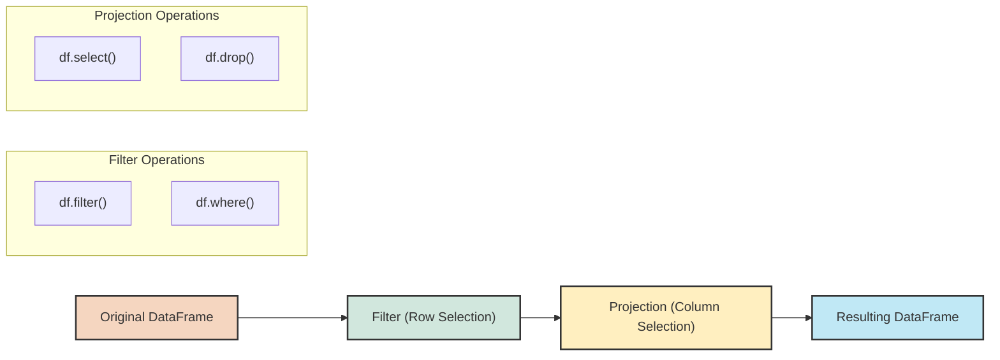
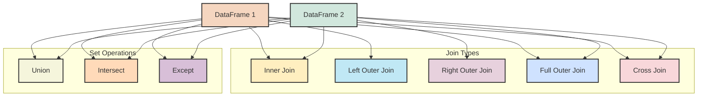
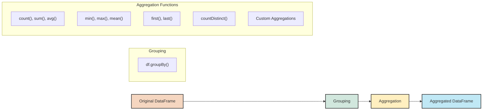

## 4. Data Manipulation with PySpark

### 4.1 Column Operations and Expressions

Manipulating data in PySpark often involves working with columns and expressions. PySpark provides a rich set of functions to transform and analyze column data effectively.

```mermaid
flowchart TD
    Column["Column Operations"] --> Arithmetic["Arithmetic Operations"]
    Column --> String["String Operations"]
    Column --> Date["Date/Time Operations"]
    Column --> Conditional["Conditional Operations"]
    Column --> Aggregate["Aggregate Functions"]
    Column --> Window["Window Functions"]
    
    Arithmetic --> Add["+ (Addition)"]
    Arithmetic --> Sub["- (Subtraction)"]
    Arithmetic --> Mul["* (Multiplication)"]
    Arithmetic --> Div["/ (Division)"]
    
    String --> Concat["concat()"]
    String --> Substring["substring()"]
    String --> Upper["upper()/lower()"]
    
    Date --> Extract["year(), month(), day()"]
    Date --> Format["date_format()"]
    Date --> Add1["date_add()"]
    
    Conditional --> When["when().otherwise()"]
    Conditional --> Case["case when expressions"]
    
    style Column fill:#f5d6c0,stroke:#333,stroke-width:2px
    style Arithmetic fill:#d1e7dd,stroke:#333,stroke-width:2px
    style String fill:#ffefc0,stroke:#333,stroke-width:2px
    style Date fill:#c0e8f5,stroke:#333,stroke-width:2px
    style Conditional fill:#e7d1dd,stroke:#333,stroke-width:2px
    style Aggregate fill:#cfe2ff,stroke:#333,stroke-width:2px
    style Window fill:#f8d7da,stroke:#333,stroke-width:2px
```



#### Importing Functions

PySpark provides a wide range of built-in functions through the `pyspark.sql.functions` module. Most column operations use these functions:

```python
# Import commonly used functions
from pyspark.sql.functions import (
    col, lit, expr,  # Basic column references and expressions
    concat, substring, lower, upper, trim,  # String functions
    year, month, dayofmonth, hour, minute, second,  # Date functions
    round, sqrt, abs,  # Math functions
    when, coalesce,  # Conditional functions
    count, sum, avg, min, max,  # Aggregate functions
    dense_rank, row_number, lead, lag  # Window functions
)
```

#### Working with Column Expressions

There are several ways to reference and manipulate columns in PySpark:

```python
# Different ways to reference columns
df.select(
    df.age,           # Object attribute notation
    df["name"],        # Dictionary notation
    col("salary"),     # Using col() function
    expr("department")  # Using expr() function
).show()

# Using functions with columns
df.select(
    col("first_name"),
    col("last_name"),
    concat(col("first_name"), lit(" "), col("last_name")).alias("full_name")
).show()
```

#### Arithmetic Operations

You can perform basic arithmetic operations on numeric columns:

```python
# Arithmetic operations
df.select(
    col("salary"),
    col("salary") + 1000,  # Addition
    col("salary") - 1000,  # Subtraction
    col("salary") * 1.1,   # Multiplication
    col("salary") / 12,    # Division
    col("salary") % 1000,  # Modulo
).show()

# Using mathematical functions
from pyspark.sql.functions import round, sqrt, pow, abs

df.select(
    col("value"),
    round(col("value"), 2),  # Round to 2 decimal places
    sqrt(col("value")),      # Square root
    pow(col("value"), 2),     # Value squared
    abs(col("value"))        # Absolute value
).show()
```

#### String Operations

PySpark provides numerous functions for string manipulation:

```python
# String functions
from pyspark.sql.functions import (
    concat, concat_ws, substring, length, 
    upper, lower, trim, ltrim, rtrim,
    regexp_replace, regexp_extract
)

df.select(
    col("name"),
    upper(col("name")),           # Convert to uppercase
    lower(col("name")),           # Convert to lowercase
    length(col("name")),          # String length
    substring(col("name"), 1, 3),  # Extract substring (1-based indexing)
    concat(col("name"), lit(" Jr.")),  # Concatenate strings
    # Concatenate with separator
    concat_ws(" ", col("first_name"), col("middle_name"), col("last_name")),
    # Regular expression replacement
    regexp_replace(col("text"), "[0-9]+", "NUMBER"),
    # Regular expression extraction
    regexp_extract(col("email"), "(\\w+)@(\\w+)\\.(\\w+)", 1).alias("email_user")
).show()
```

#### Date and Time Operations

Working with dates and timestamps is common in data processing:

```python
# Date functions
from pyspark.sql.functions import (
    current_date, current_timestamp, date_format,
    year, month, dayofmonth, dayofweek,
    date_add, date_sub, datediff, months_between
)

df.select(
    col("date_column"),
    current_date().alias("today"),   # Current date
    current_timestamp().alias("now"),  # Current timestamp
    year(col("date_column")),        # Extract year
    month(col("date_column")),       # Extract month
    dayofmonth(col("date_column")),  # Extract day
    dayofweek(col("date_column")),   # Day of week (1 = Sunday, 2 = Monday, ...)
    # Format date as string
    date_format(col("date_column"), "yyyy-MM-dd").alias("formatted_date"),
    date_add(col("date_column"), 7).alias("next_week"),  # Add days
    date_sub(col("date_column"), 7).alias("last_week"),  # Subtract days
    datediff(current_date(), col("date_column")).alias("days_ago"),  # Days between
    months_between(current_date(), col("date_column")).alias("months_ago")  # Months between
).show()
```

#### Conditional Expressions

Conditional logic allows for more complex transformations:

```python
# Conditional functions
from pyspark.sql.functions import when, coalesce

# Using when/otherwise for if-then-else logic
df.select(
    col("age"),
    when(col("age") < 18, "Minor")
    .when(col("age") < 65, "Adult")
    .otherwise("Senior").alias("age_group")
).show()

# Multiple conditions with when
df.select(
    col("salary"),
    when(col("salary") < 50000, "Low")
    .when(col("salary") < 100000, "Medium")
    .when(col("salary") < 150000, "High")
    .otherwise("Very High").alias("salary_bracket")
).show()

# coalesce - returns first non-null value
df.select(
    col("primary_email"),
    col("secondary_email"),
    col("backup_email"),
    coalesce(col("primary_email"), col("secondary_email"), col("backup_email"), lit("no-email")).alias("contact_email")
).show()
```

#### Complex Expressions with expr()

The `expr()` function allows you to write SQL-like expressions as strings:

```python
# Using expr for complex expressions
df.select(
    col("first_name"),
    col("last_name"),
    expr("concat(first_name, ' ', last_name)").alias("full_name"),
    expr("case when age < 18 then 'Minor' when age < 65 then 'Adult' else 'Senior' end").alias("age_group"),
    expr("salary * 0.2").alias("bonus")
).show()
```

#### Knowledge Check

> **Question**: What's the difference between using column operations with functions like `col()` versus using SQL expressions with `expr()`?
> 
> **Answer**: Both approaches accomplish similar goals but with different syntax. The `col()` approach offers a more programmatic, type-safe way to work with columns and is often preferred for complex operations. The `expr()` approach uses SQL-like string expressions, which can be more concise and familiar to those with SQL experience. Both can be mixed in the same query, choosing whichever is more readable for the specific operation.

### 4.2 Filtering and Projection

Filtering (selecting rows) and projection (selecting columns) are fundamental operations in data processing. While we've touched on these earlier, let's explore more advanced techniques.



#### Advanced Filtering

```python
# Advanced filtering techniques
from pyspark.sql.functions import col, array_contains, isnull, to_date

# Filter with complex conditions
df_filtered = df.filter(
    (col("age") > 25) & 
    (col("department").isin("Engineering", "Marketing")) & 
    (col("salary") >= 50000)
)

# Filter with array containment
df_tagged = df.filter(array_contains(col("tags"), "python"))

# Filter based on null values in multiple columns
df_complete = df.filter(~isnull("email") & ~isnull("phone"))

# Filter based on date ranges
start_date = to_date(lit("2023-01-01"))
end_date = to_date(lit("2023-12-31"))
df_2023 = df.filter((col("hire_date") >= start_date) & (col("hire_date") <= end_date))

# Filter with regular expressions
df_gmail = df.filter(col("email").rlike("@gmail\\.com$"))
```

#### Advanced Projection

```python
# Advanced projection techniques
from pyspark.sql.functions import col, struct, array

# Select with dynamic columns
columns_to_select = ["id", "name", "email"]
df_selected = df.select(*columns_to_select)

# Select all columns matching a pattern
name_cols = [c for c in df.columns if c.endswith("_name")]
df_names = df.select("id", *name_cols)

# Select with column renaming
df_renamed = df.select(
    col("id"),
    col("first_name").alias("fname"),
    col("last_name").alias("lname")
)

# Creating struct columns (nested structures)
df_nested = df.select(
    "id",
    struct("first_name", "last_name").alias("name"),
    struct("street", "city", "state", "zip").alias("address")
)

# Creating array columns
df_array = df.select(
    "id",
    array("skill1", "skill2", "skill3").alias("skills")
)
```

### 4.3 Joins and Unions

Combining data from multiple DataFrames is a common requirement in data processing. PySpark provides various methods to join and union DataFrames.



#### Join Operations

Joins combine rows from two DataFrames based on related columns:

```python
# Sample DataFrames for joins
employees = spark.createDataFrame([
    (1, "Alice", "Engineering", 100),
    (2, "Bob", "Marketing", 200),
    (3, "Charlie", "Sales", 300),
    (4, "Diana", "Engineering", 400)
], ["id", "name", "department", "dept_id"])

departments = spark.createDataFrame([
    (100, "Engineering", "Building A"),
    (200, "Marketing", "Building B"),
    (300, "Sales", "Building C"),
    (500, "HR", "Building D")
], ["dept_id", "dept_name", "location"])

# Inner join (default)
inner_join = employees.join(
    departments,
    employees.dept_id == departments.dept_id,
    "inner"
)

# Left outer join
left_join = employees.join(
    departments,
    employees.dept_id == departments.dept_id,
    "left"
)

# Right outer join
right_join = employees.join(
    departments,
    employees.dept_id == departments.dept_id,
    "right"
)

# Full outer join
full_join = employees.join(
    departments,
    employees.dept_id == departments.dept_id,
    "full"
)

# Cross join (Cartesian product)
cross_join = employees.crossJoin(departments)

# Join with column selection
join_select = employees.join(
    departments,
    employees.dept_id == departments.dept_id
).select(
    employees.id,
    employees.name,
    departments.dept_name,
    departments.location
)

# Join with multiple conditions
multi_condition_join = employees.join(
    departments,
    (employees.dept_id == departments.dept_id) & 
    (employees.department == departments.dept_name),
    "inner"
)
```

#### Join Strategies and Best Practices

Joins can be expensive operations, especially with large datasets. Here are some strategies to optimize joins:

```python
# Broadcast join for small tables
from pyspark.sql.functions import broadcast

# Explicitly broadcast the smaller table
broadcast_join = employees.join(
    broadcast(departments),
    employees.dept_id == departments.dept_id
)

# Filter before join to reduce data size
filtered_join = employees.filter(col("department") == "Engineering").join(
    departments.filter(col("location") == "Building A"),
    employees.dept_id == departments.dept_id
)

# Use appropriate join type
# If you only need matching records, use inner join instead of outer joins
# If one table is much larger, put it on the left side of a left join
```

#### Set Operations

PySpark provides set operations to combine or compare DataFrames with compatible schemas:

```python
# Sample DataFrames for set operations
team1 = spark.createDataFrame([
    (1, "Alice"),
    (2, "Bob"),
    (3, "Charlie")
], ["id", "name"])

team2 = spark.createDataFrame([
    (2, "Bob"),
    (3, "Charlie"),
    (4, "Diana")
], ["id", "name"])

# Union (combines all rows, keeps duplicates)
union_df = team1.union(team2)

# Union all (alias for union in PySpark)
union_all_df = team1.unionAll(team2)

# Union by name (matches columns by name, not position)
union_by_name_df = team1.unionByName(team2)

# Distinct union (removes duplicates)
distinct_union_df = team1.union(team2).distinct()

# Intersect (only rows in both DataFrames)
intersect_df = team1.intersect(team2)

# Except/Subtract (rows in first DataFrame but not in second)
except_df = team1.exceptAll(team2)  # keeps duplicates
subtract_df = team1.subtract(team2)  # equivalent to except
```

#### Knowledge Check

> **Question**: When would you choose to use a broadcast join over a regular join in PySpark?
> 
> **Answer**: Use a broadcast join when one of your DataFrames is significantly smaller than the other (typically less than a few hundred MB). In a broadcast join, the smaller DataFrame is sent to all executor nodes, avoiding the need for expensive data shuffling. This can dramatically improve performance for joins where one table is small enough to fit in memory.

### 4.4 Grouping and Aggregation

Grouping and aggregation are essential for summarizing and analyzing data. PySpark provides powerful functions for these operations.



#### Basic Grouping and Aggregation

```python
# Sample DataFrame for aggregation examples
employee_data = spark.createDataFrame([
    ("Engineering", "Alice", 100000, "NY"),
    ("Engineering", "Bob", 90000, "CA"),
    ("Engineering", "Carol", 95000, "CA"),
    ("Marketing", "Dave", 85000, "NY"),
    ("Marketing", "Eve", 80000, "CA"),
    ("Sales", "Frank", 70000, "NY"),
    ("Sales", "Grace", 75000, "CA"),
    ("Sales", "Heidi", 73000, "NY")
], ["department", "name", "salary", "state"])

# Group by one column with a single aggregation
dept_count = employee_data.groupBy("department").count()

# Group by one column with multiple aggregations
from pyspark.sql.functions import count, sum, avg, min, max, round

dept_stats = employee_data.groupBy("department").agg(
    count("*").alias("employee_count"),
    round(sum("salary"), 2).alias("total_salary"),
    round(avg("salary"), 2).alias("avg_salary"),
    min("salary").alias("min_salary"),
    max("salary").alias("max_salary")
)

# Group by multiple columns
location_dept_stats = employee_data.groupBy("state", "department").agg(
    count("*").alias("employee_count"),
    round(avg("salary"), 2).alias("avg_salary")
)
```

#### Advanced Aggregation Functions

```python
# More advanced aggregation functions
from pyspark.sql.functions import (
    count, countDistinct, sum, avg, 
    min, max, first, last,
    collect_list, collect_set, array_sort
)

# Count distinct values
distinct_states = employee_data.groupBy("department").agg(
    countDistinct("state").alias("num_states")
)

# First and last values within group
first_last = employee_data.groupBy("department").agg(
    first("name").alias("first_employee"),
    last("name").alias("last_employee")
)

# Collect values into arrays
collect_values = employee_data.groupBy("department").agg(
    collect_list("name").alias("all_employees"),
    collect_set("state").alias("unique_states"),
    array_sort(collect_list("salary")).alias("salaries_sorted")
)
```

#### Pivot Operations

Pivot operations transform row values into columns, creating a cross-tabulation of your data:

```python
# Pivot example - count of employees by department and state
dept_state_pivot = employee_data.groupBy("department").pivot("state").count()

# Pivot with explicit values and multiple aggregations
from pyspark.sql.functions import sum, avg

salary_pivot = employee_data.groupBy("department") \
    .pivot("state", ["NY", "CA"]) \
    .agg(
        count("*").alias("count"),
        round(sum("salary"), 2).alias("total")
    )

# Unpivot (melt) - transforming columns back to rows
# First create a temporary view to use SQL for unpivot
dept_state_pivot.createOrReplaceTempView("pivoted_data")

# Use stack function to unpivot
unpivoted = spark.sql("""
    SELECT department, stack(2, 
        'NY', NY,
        'CA', CA
    ) as (state, employee_count)
    FROM pivoted_data
""")
```

#### Filtering After Aggregation

You can filter groups based on aggregate values:

```python
# Find departments with average salary over 90000
high_salary_depts = employee_data.groupBy("department").agg(
    avg("salary").alias("avg_salary")
).filter(col("avg_salary") > 90000)

# Find states with at least 3 employees
populated_states = employee_data.groupBy("state").agg(
    count("*").alias("employee_count")
).filter(col("employee_count") >= 3)

# Find departments in all states (having count of distinct states = total states)
total_states = employee_data.select("state").distinct().count()

depts_in_all_states = employee_data.groupBy("department").agg(
    countDistinct("state").alias("state_count")
).filter(col("state_count") == total_states)
```

#### Knowledge Check

> **Question**: How would you find the average salary for each department, but only include departments that have employees in both NY and CA states?
> 
> **Answer**: You can approach this in two ways:
> 
> ```python
> # First, find departments present in both states
> depts_in_both = employee_data.groupBy("department").agg(
>     countDistinct("state").alias("state_count")
> ).filter(col("state_count") >= 2)
> 
> # Then join with the aggregated data
> dept_avg = employee_data.groupBy("department").agg(
>     avg("salary").alias("avg_salary")
> )
> 
> result = dept_avg.join(depts_in_both, "department")
> ```
> 
> Or more concisely:
> 
> ```python
> # Using having-like logic
> from pyspark.sql.functions import collect_set
> 
> result = employee_data.groupBy("department").agg(
>     avg("salary").alias("avg_salary"),
>     collect_set("state").alias("states")
> ).filter(array_contains(col("states"), "NY") & array_contains(col("states"), "CA"))
> ```
