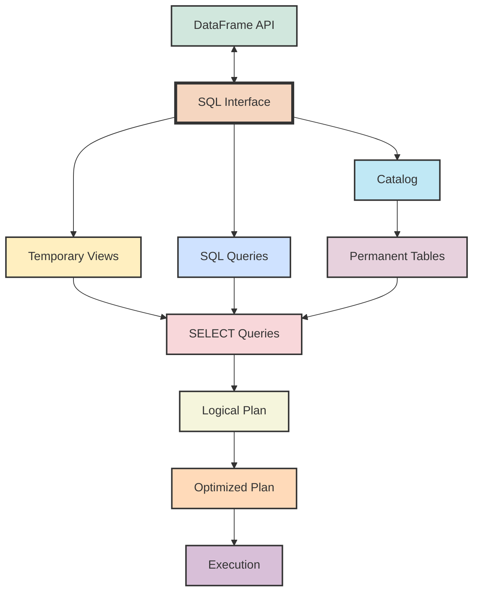
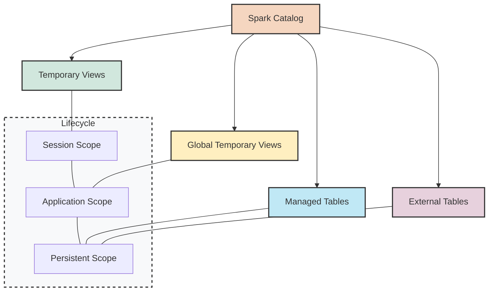
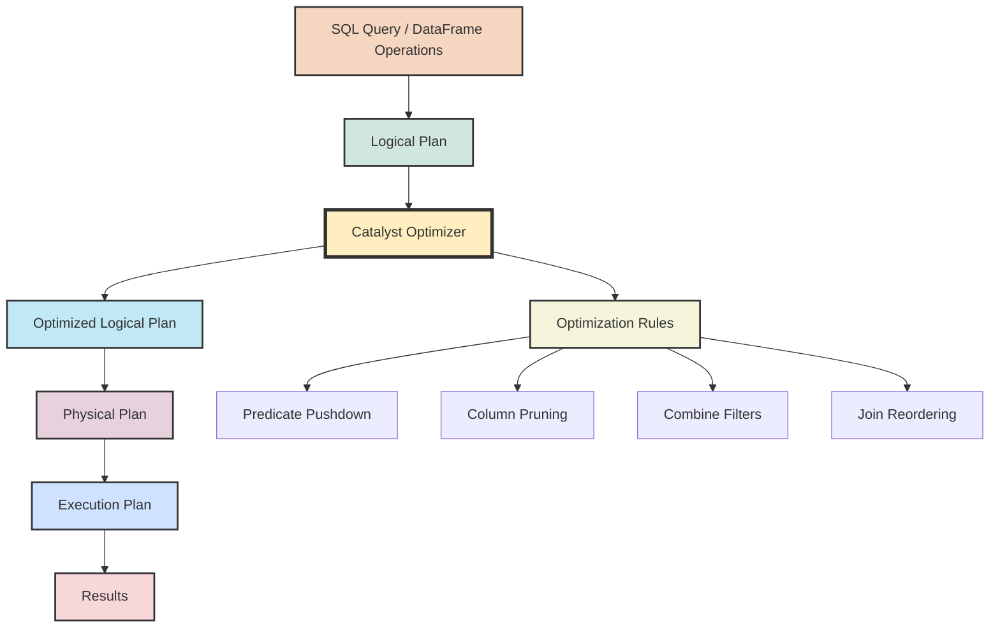

## 5. Spark SQL and Query Optimization

### 5.1 Writing SQL Queries in Spark

Spark SQL provides a powerful interface for structured data processing using SQL syntax. This feature makes Spark accessible to data analysts and engineers already familiar with SQL, while still leveraging Spark's distributed processing capabilities.



#### Creating Temporary Views

To use SQL with DataFrames, first register them as temporary views:

```python
# Sample DataFrame
employees = spark.createDataFrame([
    (1, "Alice", "Data Science", 90000, "NY"),
    (2, "Bob", "Engineering", 85000, "CA"),
    (3, "Charlie", "Data Science", 120000, "WA"),
    (4, "Diana", "Engineering", 110000, "CA"),
    (5, "Eva", "Marketing", 95000, "NY")
], ["id", "name", "department", "salary", "state"])

# Create a temporary view
employees.createOrReplaceTempView("employees")

# Create a global temporary view (visible across SparkSessions)
employees.createOrReplaceGlobalTempView("global_employees")
```

#### Basic SQL Queries

Once you've created a temporary view, you can run SQL queries using `spark.sql()` method:

```python
# Simple SELECT query
result = spark.sql("""
    SELECT name, department, salary 
    FROM employees 
    WHERE salary > 90000
""")
result.show()

# SQL query with aggregation
dept_stats = spark.sql("""
    SELECT 
        department, 
        COUNT(*) as employee_count, 
        ROUND(AVG(salary), 2) as avg_salary
    FROM employees
    GROUP BY department
    ORDER BY avg_salary DESC
""")
dept_stats.show()

# SQL query with JOIN
# First create another table
departments = spark.createDataFrame([
    ("Engineering", "Building A", "Jane Smith"),
    ("Data Science", "Building B", "Mike Johnson"),
    ("Marketing", "Building C", "Sarah Williams")
], ["dept_name", "location", "manager"])

departments.createOrReplaceTempView("departments")

# JOIN query
join_result = spark.sql("""
    SELECT e.name, e.department, d.location, d.manager
    FROM employees e
    JOIN departments d ON e.department = d.dept_name
    ORDER BY e.salary DESC
""")
join_result.show()
```

#### Advanced SQL Features

Spark SQL supports many advanced SQL features:

```python
# Common Table Expressions (CTEs)
cte_query = spark.sql("""
    WITH high_salary_employees AS (
        SELECT * FROM employees WHERE salary > 100000
    ),
    dept_counts AS (
        SELECT department, COUNT(*) as count FROM high_salary_employees GROUP BY department
    )
    
    SELECT e.department, e.name, e.salary, dc.count as high_earners_in_dept
    FROM employees e
    JOIN dept_counts dc ON e.department = dc.department
    ORDER BY e.salary DESC
""")

# Window functions
window_query = spark.sql("""
    SELECT 
        name, 
        department, 
        salary,
        RANK() OVER (PARTITION BY department ORDER BY salary DESC) as dept_rank,
        RANK() OVER (ORDER BY salary DESC) as overall_rank
    FROM employees
""")

# Subqueries
subquery = spark.sql("""
    SELECT name, department, salary
    FROM employees
    WHERE salary > (
        SELECT AVG(salary) FROM employees
    )
    ORDER BY salary DESC
""")

# CASE statements
case_query = spark.sql("""
    SELECT 
        name, 
        department,
        salary,
        CASE 
            WHEN salary > 100000 THEN 'High'
            WHEN salary > 90000 THEN 'Medium'
            ELSE 'Standard'
        END as salary_bracket
    FROM employees
""")
```

#### Working with Global Temporary Views

Global temporary views are visible across multiple SparkSessions within the same Spark application:

```python
# Access a global temporary view (note the special "global_temp" database prefix)
global_emp = spark.sql("SELECT * FROM global_temp.global_employees")

# Create a new SparkSession and access the global view
new_session = spark.newSession()
global_from_new = new_session.sql("SELECT * FROM global_temp.global_employees")

# Regular temporary views are NOT visible in the new session
try:
    new_session.sql("SELECT * FROM employees").show()
except Exception as e:
    print(f"Error: {e}")
```

#### SQL Functions and User-Defined Functions (UDFs)

You can use built-in SQL functions or create your own User-Defined Functions (UDFs):

```python
# Using built-in SQL functions
sql_functions = spark.sql("""
    SELECT 
        name,
        UPPER(name) as name_upper,
        LENGTH(name) as name_length,
        CONCAT(name, ' (', department, ')') as name_dept,
        YEAR(CURRENT_DATE) - 1 as last_year
    FROM employees
""")

# Register a Python function as a UDF
from pyspark.sql.types import StringType

@udf(StringType())
def generate_email(name, domain="company.com"):
    """Generate an email address from a name."""
    clean_name = name.lower().replace(" ", ".")
    return f"{clean_name}@{domain}"

# Register the UDF for SQL
spark.udf.register("generate_email", generate_email)

# Use the UDF in SQL
email_query = spark.sql("""
    SELECT 
        name, 
        department,
        generate_email(name) as email
    FROM employees
""")
```

#### Knowledge Check

> **Question**: What's the difference between a temporary view and a global temporary view in Spark SQL?
> 
> **Answer**: A regular temporary view is only available to the SparkSession that created it, and it disappears when the session ends. A global temporary view is available to all SparkSessions in the same Spark application and persists until the application ends. Global temporary views are accessed with the "global_temp" database prefix (e.g., `SELECT * FROM global_temp.view_name`).

### 5.2 Temporary Views and Tables

Understanding the differences between temporary views, global temporary views, and persistent tables is important for effectively working with Spark SQL.



#### Temporary Views

Temporary views are the most common way to work with DataFrames in SQL. They exist only for the duration of the SparkSession:

```python
# Create a temporary view
df.createOrReplaceTempView("my_temp_view")

# Query the view
result = spark.sql("SELECT * FROM my_temp_view WHERE value > 100")

# Check if a view exists
exists = spark.catalog.tableExists("my_temp_view")

# List all temporary views
temp_views = spark.catalog.listTables()
for view in temp_views:
    print(f"Name: {view.name}, Type: {view.tableType}, IsTemporary: {view.isTemporary}")

# Drop a temporary view when no longer needed
spark.catalog.dropTempView("my_temp_view")
```

#### Global Temporary Views

Global temporary views are visible to all SparkSessions in the same application and are stored in a special `global_temp` database:

```python
# Create a global temporary view
df.createOrReplaceGlobalTempView("my_global_view")

# Query the global view (note the global_temp prefix)
result = spark.sql("SELECT * FROM global_temp.my_global_view")

# Access from another session
new_session = spark.newSession()
result2 = new_session.sql("SELECT * FROM global_temp.my_global_view")

# List global temporary views
global_views = spark.catalog.listTables("global_temp")

# Drop a global temporary view
spark.catalog.dropGlobalTempView("my_global_view")
```

#### Persistent Tables

For data that needs to persist beyond the Spark application, you can create permanent tables. Spark supports two types of persistent tables:

1. **Managed Tables**: Spark manages both the metadata and data files. When a managed table is dropped, both metadata and data are deleted.

2. **External Tables**: Spark manages only the metadata; the data remains in the external location even if the table is dropped.

```python
# Create a managed table
df.write.saveAsTable("my_managed_table")

# Create an external table
df.write.option("path", "/path/to/external/storage").saveAsTable("my_external_table")

# Query a persistent table
result = spark.sql("SELECT * FROM my_managed_table")

# List all persistent tables in the default database
tables = spark.catalog.listTables()
for table in tables:
    if not table.isTemporary:
        print(f"Persistent table: {table.name}, Type: {table.tableType}")

# Drop a persistent table
spark.sql("DROP TABLE my_managed_table")
```

#### Database Operations

Spark SQL supports database operations for organizing tables:

```python
# Create a new database
spark.sql("CREATE DATABASE IF NOT EXISTS my_database")

# Set the current database
spark.sql("USE my_database")

# List all databases
databases = spark.catalog.listDatabases()
for db in databases:
    print(f"Database: {db.name}, Description: {db.description}")

# Create a table in a specific database
df.write.saveAsTable("my_database.my_table")

# Query a table in a specific database
result = spark.sql("SELECT * FROM my_database.my_table")

# Drop a database (must be empty or use CASCADE)
spark.sql("DROP DATABASE my_database")
# Force drop with all tables
spark.sql("DROP DATABASE my_database CASCADE")
```

### 5.3 Query Plans and Optimization

One of Spark's key strengths is its ability to optimize queries. Understanding query plans and the Catalyst optimizer can help you write more efficient queries.



#### Query Execution Process

When you execute a query, whether through SQL or the DataFrame API, Spark follows these steps:

1. **Parse**: Convert SQL or DataFrame operations into a logical plan (tree of logical operators)
2. **Analyze**: Resolve references, validate schema, etc.
3. **Optimize**: Apply optimization rules to improve the logical plan
4. **Physical Planning**: Convert logical plan to physical execution plan
5. **Execute**: Run the physical plan on the cluster

#### Examining Query Plans

Spark provides several methods to examine query plans:

```python
# Create a query to analyze
query = employees.filter(col("salary") > 90000) \
    .join(departments, col("department") == col("dept_name")) \
    .groupBy("location") \
    .agg(avg("salary").alias("avg_salary")) \
    .orderBy("avg_salary", ascending=False)

# View the logical plan
print("Logical Plan:")
print(query.explain())

# View the full execution plan (logical, optimized, and physical)
print("\nFull Plan:")
print(query.explain(True))

# Run SQL query and view its plan
sql_query = spark.sql("""
    SELECT location, AVG(salary) AS avg_salary
    FROM employees e
    JOIN departments d ON e.department = d.dept_name
    WHERE salary > 90000
    GROUP BY location
    ORDER BY avg_salary DESC
""")
sql_query.explain(True)
```

#### Catalyst Optimizer

The Catalyst optimizer applies various rules to transform the logical plan into a more efficient form:

1. **Predicate Pushdown**: Filters are pushed down to the data source to reduce the amount of data read.

2. **Column Pruning**: Only required columns are read from the data source.

3. **Constant Folding**: Expressions with constants are evaluated during optimization.

4. **Join Reordering**: Joins are reordered to minimize the amount of data processed.

5. **Partition Pruning**: For partitioned data, only relevant partitions are read.

#### AQE (Adaptive Query Execution)

Adaptive Query Execution, introduced in Spark 3.0, dynamically reoptimizes plans during execution:

```python
# Enable AQE (enabled by default in Spark 3.0+)
spark.conf.set("spark.sql.adaptive.enabled", "true")

# AQE dynamically adjusts join strategies based on runtime statistics
spark.conf.set("spark.sql.adaptive.join.enabled", "true")

# AQE can coalesce shuffled partitions
spark.conf.set("spark.sql.adaptive.coalescePartitions.enabled", "true")

# AQE can optimize skewed joins
spark.conf.set("spark.sql.adaptive.skewJoin.enabled", "true")
```

#### Query Plan Optimization Example

Let's look at how Spark optimizes a simple query:

```python
# Create two DataFrames to demonstrate optimization
customers = spark.createDataFrame([
    (1, "Alice", "NY"),
    (2, "Bob", "CA"),
    (3, "Charlie", "TX")
], ["customer_id", "name", "state"])

orders = spark.createDataFrame([
    (101, 1, 100.0, "2023-01-15"),
    (102, 2, 200.0, "2023-01-20"),
    (103, 1, 150.0, "2023-02-10"),
    (104, 3, 300.0, "2023-02-15")
], ["order_id", "customer_id", "amount", "order_date"])

# Register as temp views
customers.createOrReplaceTempView("customers")
orders.createOrReplaceTempView("orders")

# Write a query with optimization opportunities
query = spark.sql("""
    SELECT c.name, c.state, SUM(o.amount) as total_amount
    FROM customers c
    JOIN orders o ON c.customer_id = o.customer_id
    WHERE o.amount > 100.0 AND c.state != 'TX'
    GROUP BY c.name, c.state
""")

# Explain the optimized query
query.explain(True)
```

In this example, we can observe several optimizations:

1. Filters (`amount > 100.0` and `state != 'TX'`) are pushed down to the source tables.
2. Only necessary columns (name, state, customer_id from customers; customer_id, amount from orders) are loaded.
3. Join strategy is selected based on table sizes.

#### Knowledge Check

> **Question**: What is "predicate pushdown" in Spark SQL optimization, and why is it beneficial?
> 
> **Answer**: Predicate pushdown is an optimization where filter conditions (predicates) are moved as close as possible to the data source before data is loaded into memory. This is beneficial because it significantly reduces the amount of data that needs to be read, transferred over the network, and processed by Spark. For example, if you're querying a large dataset but only need rows where `date > '2023-01-01'`, Spark can instruct the data source to filter rows at read time rather than loading all data first and then filtering.
