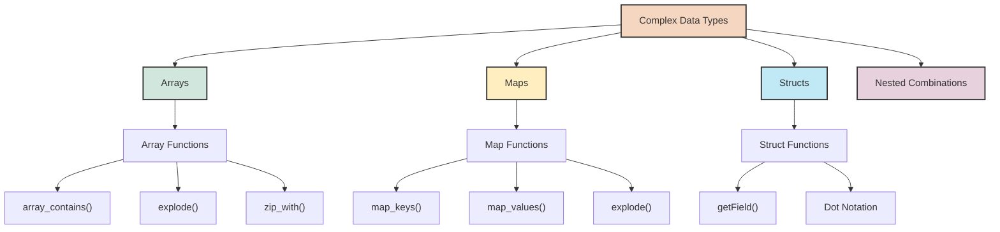
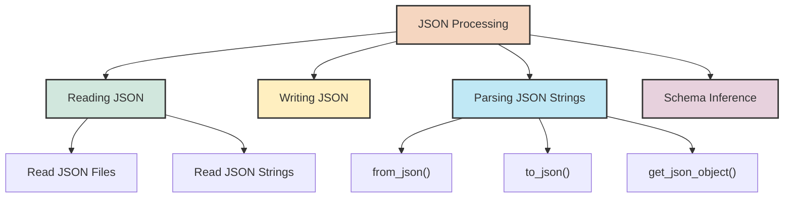
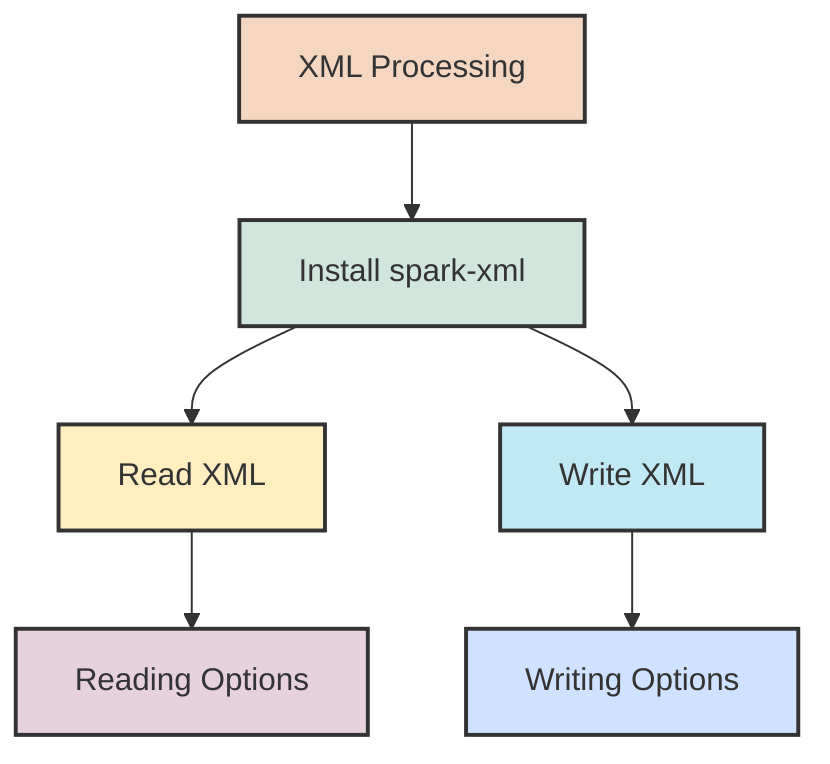

## 6. Working with Complex Data Types

### 6.1 Arrays, Maps, and Structs

Real-world data often contains complex nested structures like arrays, maps, and structs. PySpark provides powerful capabilities for working with these complex data types, allowing you to manipulate and query nested data efficiently.



#### Creating DataFrames with Complex Types

Let's start by creating DataFrames that contain various complex data types:

```python
from pyspark.sql.types import StructType, StructField, StringType, IntegerType, \
    ArrayType, MapType, DoubleType, BooleanType
from pyspark.sql.functions import col, struct, array, map_from_entries, lit

# Sample data with complex types
student_data = [
    (1, "Alice", [85, 90, 95], {"math": 85, "english": 90, "science": 95}, 
     ("123 Main St", "New York", "NY", "10001")),
    (2, "Bob", [75, 80, 85], {"math": 75, "english": 80, "science": 85}, 
     ("456 Oak Ave", "San Francisco", "CA", "94107")),
    (3, "Charlie", [90, 85, 80], {"math": 90, "english": 85, "science": 80}, 
     ("789 Pine St", "Seattle", "WA", "98101"))
]

# Define schema with complex types
schema = StructType([
    StructField("id", IntegerType(), False),
    StructField("name", StringType(), False),
    StructField("scores", ArrayType(IntegerType()), True),
    StructField("subjects", MapType(StringType(), IntegerType()), True),
    StructField("address", StructType([
        StructField("street", StringType(), True),
        StructField("city", StringType(), True),
        StructField("state", StringType(), True),
        StructField("zip", StringType(), True)
    ]), True)
])

# Create DataFrame with complex types
students_df = spark.createDataFrame(student_data, schema)
students_df.printSchema()
students_df.show(truncate=False)

# Alternative: creating complex types using DataFrame operations
simple_data = [
    (1, "Alice", 85, 90, 95, "123 Main St", "New York", "NY", "10001"),
    (2, "Bob", 75, 80, 85, "456 Oak Ave", "San Francisco", "CA", "94107"),
    (3, "Charlie", 90, 85, 80, "789 Pine St", "Seattle", "WA", "98101")
]

simple_df = spark.createDataFrame(simple_data, 
    ["id", "name", "math", "english", "science", "street", "city", "state", "zip"])

# Create array column
simple_df = simple_df.withColumn(
    "scores", array(col("math"), col("english"), col("science"))
)

# Create map column
simple_df = simple_df.withColumn(
    "subjects", 
    map_from_entries(
        array(
            struct(lit("math"), col("math")),
            struct(lit("english"), col("english")),
            struct(lit("science"), col("science"))
        )
    )
)

# Create struct column
simple_df = simple_df.withColumn(
    "address",
    struct(col("street"), col("city"), col("state"), col("zip"))
)

# Select only the columns we need
complex_df = simple_df.select("id", "name", "scores", "subjects", "address")
complex_df.printSchema()
complex_df.show(truncate=False)
```

#### Working with Array Columns

Arrays in Spark represent collections of elements of the same type. Here are common operations with array columns:

```python
from pyspark.sql.functions import array_contains, explode, size, sort_array, \
    array_distinct, array_except, array_intersect, array_union, array_join, slice, element_at

# Check if array contains a value
students_df.select(
    "name", 
    "scores",
    array_contains("scores", 85).alias("has_85_score")
).show()

# Get array length
students_df.select(
    "name", 
    "scores",
    size("scores").alias("num_scores")
).show()

# Sort array
students_df.select(
    "name", 
    "scores",
    sort_array("scores").alias("sorted_scores"),
    sort_array("scores", asc=False).alias("sorted_desc")
).show()

# Get specific element (1-based indexing)
students_df.select(
    "name", 
    "scores",
    element_at("scores", 1).alias("first_score"),
    element_at("scores", -1).alias("last_score")  # Negative index for counting from end
).show()

# Get array slice
students_df.select(
    "name", 
    "scores",
    slice("scores", 1, 2).alias("first_two_scores")
).show()

# Join array elements into string
students_df.select(
    "name", 
    "scores",
    array_join("scores", ", ").alias("scores_string")
).show()

# Explode array (transform array elements to rows)
students_df.select(
    "name",
    explode("scores").alias("individual_score")
).show()

# Explode with position
from pyspark.sql.functions import posexplode
students_df.select(
    "name",
    posexplode("scores").alias("position", "individual_score")
).show()

# Collect scores across students
from pyspark.sql.functions import collect_list, collect_set
spark.sql("""
    SELECT 
        collect_list(scores) as all_scores_with_duplicates,
        collect_set(scores) as unique_score_arrays
    FROM students
""").show(truncate=False)

# Flatten nested arrays with flattenSchema
from pyspark.sql.functions import flatten

# Create nested array example
nestedArrayDF = spark.createDataFrame(
    [("A", [[1, 2, 3], [4, 5, 6]]), ("B", [[7, 8, 9], [10, 11]])],
    ["id", "nested_array"]
)

# Flatten the nested array
nestedArrayDF.select(
    "id",
    "nested_array",
    flatten("nested_array").alias("flattened_array")
).show(truncate=False)
```

#### Working with Map Columns

Maps represent key-value pairs, similar to Python dictionaries. Here's how to work with map columns:

```python
from pyspark.sql.functions import map_keys, map_values, explode_outer, map_from_arrays

# Extract keys and values from map
students_df.select(
    "name",
    "subjects",
    map_keys("subjects").alias("subject_names"),
    map_values("subjects").alias("subject_scores")
).show(truncate=False)

# Get value for a specific key
students_df.select(
    "name",
    "subjects",
    col("subjects.math").alias("math_score"),  # Get map value using dot notation
    element_at(col("subjects"), "english").alias("english_score")  # Alternative syntax
).show()

# Check if map contains a key
from pyspark.sql.functions import map_contains_key
students_df.select(
    "name",
    "subjects",
    map_contains_key(col("subjects"), "history").alias("has_history_score")
).show()

# Create map from separate arrays
key_value_df = spark.createDataFrame([
    ("Alice", ["math", "english", "science"], [85, 90, 95]),
    ("Bob", ["math", "english", "science"], [75, 80, 85])
], ["name", "subjects", "scores"])

key_value_df.select(
    "name",
    map_from_arrays(col("subjects"), col("scores")).alias("subject_map")
).show(truncate=False)

# Explode map to rows (convert key-value pairs to rows)
students_df.select(
    "name",
    explode("subjects").alias("subject", "score")
).show()
```

#### Working with Struct Columns

Structs in Spark represent nested records with named fields. Here's how to work with struct columns:

```python
from pyspark.sql.functions import struct

# Access struct fields using dot notation
students_df.select(
    "name",
    "address.street",
    "address.city",
    "address.state",
    "address.zip"
).show()

# Alternative: Access using getField
students_df.select(
    "name",
    col("address").getField("street").alias("street_address"),
    col("address").getField("city").alias("city_name")
).show()

# Create new struct from individual fields
students_df.select(
    "name",
    struct(
        col("address.street").alias("street_address"),
        col("address.city").alias("city_name"),
        col("address.state"),
        col("address.zip")
    ).alias("formatted_address")
).show(truncate=False)

# Filter based on struct field
students_df.filter(col("address.state") == "CA").show()

# Update nested field in struct
from pyspark.sql.functions import expr

updated_address = students_df.withColumn(
    "address",
    expr("named_struct('street', address.street, 'city', address.city, 'state', address.state, 'zip', '00000')")
)
updated_address.show(truncate=False)

# Alternative approach using withField (Spark 3.1+)
# updated_address = students_df.withColumn(
#     "address",
#     col("address").withField("zip", lit("00000"))
# )
```

### 6.2 JSON Processing

JSON is a common format for semi-structured data. Spark provides excellent support for working with JSON data, whether it's parsing JSON strings or processing entire JSON files.



#### Reading and Writing JSON

```python
# Reading JSON files
json_df = spark.read.json("path/to/data.json")

# Reading JSON with explicit schema
from pyspark.sql.types import StructType, StructField, StringType, IntegerType, ArrayType

json_schema = StructType([
    StructField("name", StringType(), True),
    StructField("age", IntegerType(), True),
    StructField("skills", ArrayType(StringType()), True)
])

json_with_schema = spark.read.schema(json_schema).json("path/to/data.json")

# Writing DataFrame as JSON
df.write.json("path/to/output.json")

# Writing with options
df.write.mode("overwrite").option("compression", "gzip").json("path/to/output.json")
```

#### Parsing JSON Strings

Often, you'll have JSON stored as strings within a DataFrame column. Here's how to work with that:

```python
from pyspark.sql.functions import from_json, to_json, schema_of_json, get_json_object, json_tuple

# Sample DataFrame with JSON strings
json_string_data = [
    (1, "{\"name\": \"Alice\", \"age\": 25, \"skills\": [\"Python\", \"SQL\"]}"),
    (2, "{\"name\": \"Bob\", \"age\": 30, \"skills\": [\"Java\", \"Scala\"]}"),
    (3, "{\"name\": \"Charlie\", \"age\": 35, \"skills\": [\"Python\", \"Spark\"]}")
]
json_string_df = spark.createDataFrame(json_string_data, ["id", "json_data"])

# Infer schema from JSON strings
sample_json = json_string_df.select("json_data").first()[0]
inferred_schema = schema_of_json(lit(sample_json))
print(f"Inferred schema: {inferred_schema}")

# Define schema for JSON parsing
json_schema = StructType([
    StructField("name", StringType(), True),
    StructField("age", IntegerType(), True),
    StructField("skills", ArrayType(StringType()), True)
])

# Parse JSON strings to struct using from_json
parsed_df = json_string_df.withColumn(
    "parsed_data", 
    from_json(col("json_data"), json_schema)
)
parsed_df.show(truncate=False)

# Access fields from the parsed JSON
parsed_df.select(
    "id",
    "parsed_data.name",
    "parsed_data.age",
    "parsed_data.skills"
).show(truncate=False)

# Extract specific fields without parsing the entire JSON
extracted_df = json_string_df.select(
    "id",
    get_json_object(col("json_data"), "$.name").alias("name"),
    get_json_object(col("json_data"), "$.age").alias("age"),
    get_json_object(col("json_data"), "$.skills[0]").alias("first_skill")
)
extracted_df.show()

# Extract multiple fields at once with json_tuple
tupled_df = json_string_df.select(
    "id",
    json_tuple(col("json_data"), "name", "age").alias("name", "age")
)
tupled_df.show()

# Convert struct to JSON string
from_struct_df = parsed_df.select(
    "id",
    to_json(col("parsed_data")).alias("json_string")
)
from_struct_df.show(truncate=False)
```

### 6.3 Working with XML Data

XML is another common format for semi-structured data. While Spark doesn't include built-in XML support, you can use the `spark-xml` package to work with XML data.



#### Setting Up XML Support

```python
# Install the spark-xml package
# This can be done in Databricks by adding the Maven coordinates
# com.databricks:spark-xml_2.12:0.14.0 to the cluster configuration

# Alternatively, if you're using PySpark outside Databricks, you can include 
# the package when starting PySpark:
# pyspark --packages com.databricks:spark-xml_2.12:0.14.0
```

#### Reading and Writing XML

```python
# Reading XML files
xml_df = spark.read.format("xml") \
    .option("rowTag", "book") \
    .load("path/to/books.xml")

# Reading XML with options
xml_df = spark.read.format("xml") \
    .option("rowTag", "book") \
    .option("attributePrefix", "_") \
    .option("valueTag", "_VALUE") \
    .load("path/to/books.xml")

# Writing DataFrame as XML
df.write.format("xml") \
    .option("rootTag", "books") \
    .option("rowTag", "book") \
    .save("path/to/output.xml")
```

#### XML Processing Options

The `spark-xml` package offers many options for reading and writing XML:

**Reading Options:**
- `rowTag`: The XML tag name for rows (required)
- `samplingRatio`: Sampling ratio for schema inference (default: 1.0)
- `excludeAttribute`: Whether to exclude attributes (default: false)
- `attributePrefix`: Prefix for attributes (default: _)
- `valueTag`: Tag used for the value when a key has both attributes and a value (default: _VALUE)

**Writing Options:**
- `rootTag`: Root tag of the XML (default: rows)
- `rowTag`: Row tag of the XML (default: row)
- `declaration`: XML declaration (default: version="1.0" encoding="UTF-8")
- `nullValue`: Value to write for null fields (default: null)

#### Knowledge Check

> **Question**: How would you extract specific elements from an array column in a DataFrame and convert them to individual rows?
> 
> **Answer**: You would use the `explode()` function to transform array elements into rows. For example:
> ```python
> from pyspark.sql.functions import explode
> 
> # Assuming df has a column 'items' which is an array
> exploded_df = df.select(
>     "id",  # Keep other columns you need
>     explode("items").alias("single_item")
> )
> ```
> This will create a new row for each element in the 'items' array, paired with the corresponding 'id' value from the original row.
