## 7. ETL Operations in Spark

### 7.1 Data Cleaning and Validation

Extract, Transform, Load (ETL) is a fundamental process in data engineering. It involves extracting data from various sources, transforming it to fit business needs, and loading it into a target data store. Spark is an excellent platform for implementing ETL processes because of its scalability and rich data processing capabilities.

```mermaid
flowchart LR
    Extract["Extract"] --> Transform["Transform"] --> Load["Load"]
    
    subgraph "Extract"
    E1["Read from sources"] 
    E2["Parse formats"] 
    E3["Filter initial data"] 
    end
    
    subgraph "Transform"
    T1["Clean"] 
    T2["Validate"] 
    T3["Standardize"] 
    T4["Enrich"] 
    T5["Aggregate"] 
    end
    
    subgraph "Load"
    L1["Format output"] 
    L2["Write to target"] 
    L3["Verify loading"] 
    end
    
    style Extract fill:#f5d6c0,stroke:#333,stroke-width:2px
    style Transform fill:#d1e7dd,stroke:#333,stroke-width:2px
    style Load fill:#ffefc0,stroke:#333,stroke-width:2px
    style E1 fill:#f8d7da,stroke:#333,stroke-width:2px
    style E2 fill:#f8d7da,stroke:#333,stroke-width:2px
    style E3 fill:#f8d7da,stroke:#333,stroke-width:2px
    style T1 fill:#cfe2ff,stroke:#333,stroke-width:2px
    style T2 fill:#cfe2ff,stroke:#333,stroke-width:2px
    style T3 fill:#cfe2ff,stroke:#333,stroke-width:2px
    style T4 fill:#cfe2ff,stroke:#333,stroke-width:2px
    style T5 fill:#cfe2ff,stroke:#333,stroke-width:2px
    style L1 fill:#fff3cd,stroke:#333,stroke-width:2px
    style L2 fill:#fff3cd,stroke:#333,stroke-width:2px
    style L3 fill:#fff3cd,stroke:#333,stroke-width:2px
```



Data cleaning is often the most time-consuming aspect of ETL. Real-world data is messy, with issues like missing values, duplicates, inconsistent formats, and outliers. Let's explore how to address these issues in Spark.

#### Handling Missing Values

```python
from pyspark.sql.functions import col, count, when, isnan, isnull, coalesce, lit

# Sample data with missing values
data = [
    (1, "Alice", 25, "NY", 50000),
    (2, "Bob", None, "CA", 60000),
    (3, "Charlie", 35, None, None),
    (4, None, 40, "TX", 70000),
    (5, "Eve", 30, "FL", None)
]

df = spark.createDataFrame(data, ["id", "name", "age", "state", "salary"])

# Identify missing values
def count_nulls(df):
    """Count null values in each column of a DataFrame"""
    return df.select([count(when(col(c).isNull() | isnan(c), c)).alias(c) for c in df.columns])

count_nulls(df).show()

# Option 1: Drop rows with missing values
df_no_nulls = df.na.drop()  # Drop any row with any null value
df_no_nulls.show()

# Drop rows with null in specific columns only
df_required = df.na.drop(subset=["id", "name"])  # Keep only rows with id and name
df_required.show()

# Option 2: Fill missing values with constants
df_filled = df.na.fill({
    "age": 0,
    "state": "Unknown",
    "salary": 0,
    "name": "Unknown"
})
df_filled.show()

# Option 3: Fill with statistics or derived values
# Calculate average age and salary
avg_age = df.select("age").filter(col("age").isNotNull()).agg({"age": "avg"}).collect()[0][0]
avg_salary = df.filter(col("salary").isNotNull()).agg({"salary": "avg"}).collect()[0][0]

# Fill with calculated values
df_calculated = df.na.fill({
    "age": avg_age,
    "salary": avg_salary
})
df_calculated.show()

# Option 4: More advanced filling with expressions
df_advanced = df.withColumn(
    "age", 
    coalesce(col("age"), lit(avg_age))
).withColumn(
    "salary",
    coalesce(col("salary"), when(col("state") == "NY", 55000).otherwise(avg_salary))
)
df_advanced.show()
```

#### Removing Duplicates

```python
# Sample data with duplicates
dup_data = [
    (1, "Alice", "NY"),
    (2, "Bob", "CA"),
    (1, "Alice", "NY"),  # Exact duplicate
    (3, "Alice", "NY"),  # Partial duplicate (same name and state)
    (4, "Charlie", "TX"),
    (5, "Bob", "FL"),    # Partial duplicate (same name)
]

dup_df = spark.createDataFrame(dup_data, ["id", "name", "state"])
dup_df.show()

# Remove exact duplicates
df_distinct = dup_df.distinct()
df_distinct.show()

# Remove duplicates based on specific columns
df_dedup = dup_df.dropDuplicates(["name", "state"])
df_dedup.show()

# Keep first occurrence of duplicates
from pyspark.sql.window import Window
from pyspark.sql.functions import row_number

# Define window specification for partitioning by name and state, ordering by id
window_spec = Window.partitionBy("name", "state").orderBy("id")

# Add row number within each partition
df_with_row_num = dup_df.withColumn("row_num", row_number().over(window_spec))

# Keep only the first occurrence in each partition
df_first_occurrence = df_with_row_num.filter(col("row_num") == 1).drop("row_num")
df_first_occurrence.show()
```

#### Standardizing Data

```python
from pyspark.sql.functions import trim, upper, lower, regexp_replace, translate, lpad, to_date

# Sample data with format inconsistencies
messy_data = [
    (1, " Alice ", "NY", "F", "2023/01/15"),
    (2, "bob", "ca", "MALE", "01-15-2023"),
    (3, "CHARLIE", "TX", "m", "2023.01.15"),
    (4, "Diana123", "FL", "female", "Jan 15, 2023"),
    (5, "Eve-Smith", "WA", "FEMALE", "15/01/2023")
]

messy_df = spark.createDataFrame(messy_data, ["id", "name", "state", "gender", "date"])
messy_df.show()

# Standardize text: trim spaces, consistent case
std_df = messy_df.withColumn(
    "name", 
    trim(col("name"))  # Remove leading/trailing spaces
).withColumn(
    "name",
    initcap(col("name"))  # Title case (first letter of each word uppercase)
).withColumn(
    "state",
    upper(col("state"))  # Uppercase state codes
)

# Standardize gender codes
std_df = std_df.withColumn(
    "gender_code",
    when(lower(col("gender")).isin("m", "male"), "M")
    .when(lower(col("gender")).isin("f", "female"), "F")
    .otherwise("U")  # Unknown
)

# Clean up names (remove non-alphabetic characters)
std_df = std_df.withColumn(
    "clean_name",
    regexp_replace(col("name"), "[^a-zA-Z ]", "")  # Remove non-alphabetic chars
)

# Standardize dates (convert various formats to standard date type)
std_df = std_df.withColumn(
    "standard_date",
    coalesce(
        to_date(col("date"), "yyyy/MM/dd"),
        to_date(col("date"), "MM-dd-yyyy"),
        to_date(col("date"), "yyyy.MM.dd"),
        to_date(col("date"), "MMM dd, yyyy"),
        to_date(col("date"), "dd/MM/yyyy")
    )
)

std_df.show()
```

#### Data Validation

Data validation ensures that data meets quality standards before proceeding with further processing.

```python
from pyspark.sql.functions import col, length, regexp_extract

# Sample data for validation
validation_data = [
    (1, "Alice", 25, "alice@example.com", "123-45-6789"),
    (2, "Bob", 17, "bob@example", "123-45-678"),
    (3, "Charlie", 135, "charlie@gmail.com", "123-45-6789"),
    (4, "Diana", 32, "diana.example.com", "12345-6789"),
    (5, "Eve", 29, "eve@example.com", "123-45-6789")
]

val_df = spark.createDataFrame(validation_data, 
                              ["id", "name", "age", "email", "ssn"])

# Define validation rules
is_valid_age = (col("age") >= 18) & (col("age") <= 120)
is_valid_email = col("email").rlike("^[a-zA-Z0-9_.+-]+@[a-zA-Z0-9-]+\\.[a-zA-Z0-9-.]+$")
is_valid_ssn = col("ssn").rlike("^\\d{3}-\\d{2}-\\d{4}$")

# Add validation flags
validated_df = val_df.withColumn("valid_age", is_valid_age)
validated_df = validated_df.withColumn("valid_email", is_valid_email)
validated_df = validated_df.withColumn("valid_ssn", is_valid_ssn)

# Add overall validity flag
validated_df = validated_df.withColumn(
    "is_valid_record",
    is_valid_age & is_valid_email & is_valid_ssn
)

validated_df.show()

# Filter out invalid records
valid_records = validated_df.filter(col("is_valid_record"))
valid_records.show()

# Collect invalid records for reporting
invalid_records = validated_df.filter(~col("is_valid_record"))
invalid_records.show()

# Generate validation report
validation_report = validated_df.agg(
    count("*").alias("total_records"),
    sum(when(col("valid_age"), 1).otherwise(0)).alias("valid_age_count"),
    sum(when(col("valid_email"), 1).otherwise(0)).alias("valid_email_count"),
    sum(when(col("valid_ssn"), 1).otherwise(0)).alias("valid_ssn_count"),
    sum(when(col("is_valid_record"), 1).otherwise(0)).alias("valid_record_count")
)
validation_report.show()
```

#### Knowledge Check

> **Question**: What's the difference between using `df.na.drop()` and `df.dropDuplicates()` in a PySpark DataFrame?
> 
> **Answer**: `df.na.drop()` removes rows containing null/missing values, helping to clean data where missing values would cause problems in analysis. `df.dropDuplicates()` removes duplicate rows (exact matches across all columns by default, or matches on specified columns), which helps eliminate redundancy in the dataset. The two functions address different data quality issues and are often used together in data cleaning pipelines.
