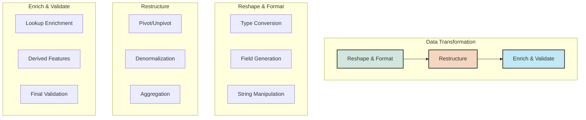
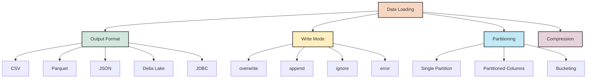

### 7.2 Data Transformation and Enrichment

Beyond cleaning and validating data, transformation involves reshaping, restructuring, and enriching data to make it suitable for analysis or downstream applications. Spark provides powerful functions for these transformation tasks.



#### Reshaping and Type Transformations

```python
from pyspark.sql.functions import col, concat, concat_ws, substring, to_date, to_timestamp
from pyspark.sql.functions import year, month, dayofmonth, hour, minute, expr
from pyspark.sql.functions import round as spark_round, format_number

# Sample data
data = [
    (1, "John Doe", "1980-05-15", "New York", 75000.5678, "Engineer"),
    (2, "Jane Smith", "1992-10-28", "San Francisco", 85000.1234, "Data Scientist"),
    (3, "Bob Johnson", "1975-03-21", "Chicago", 92000.7541, "Manager"),
]

df = spark.createDataFrame(data, ["id", "name", "birth_date", "city", "salary", "title"])

# 1. Type conversions
transformed_df = df.withColumn(
    "birth_date", 
    to_date(col("birth_date"))  # Convert string to date
).withColumn(
    "salary", 
    col("salary").cast("double")  # Ensure salary is double type
)

# 2. Extract components from dates
transformed_df = transformed_df.withColumn(
    "birth_year", 
    year(col("birth_date"))
).withColumn(
    "birth_month", 
    month(col("birth_date"))
).withColumn(
    "birth_day", 
    dayofmonth(col("birth_date"))
)

# 3. String transformations
transformed_df = transformed_df.withColumn(
    "first_name", 
    expr("split(name, ' ')[0]")
).withColumn(
    "last_name", 
    expr("split(name, ' ')[1]")
).withColumn(
    "name_length", 
    length(col("name"))
)

# 4. Numerical transformations
transformed_df = transformed_df.withColumn(
    "salary_k", 
    (col("salary") / 1000).cast("integer")
).withColumn(
    "salary_formatted", 
    format_number(col("salary"), 2)  # Format with 2 decimal places
).withColumn(
    "salary_rounded", 
    spark_round(col("salary"), 0)  # Round to nearest integer
)

transformed_df.show()
```

#### Advanced Restructuring

```python
from pyspark.sql.functions import expr, collect_list, struct, col, explode

# Sample sales data
sales_data = [
    ("2023-01-15", "A", 100),
    ("2023-01-15", "B", 200),
    ("2023-01-16", "A", 120),
    ("2023-01-16", "B", 210),
    ("2023-01-17", "A", 130),
    ("2023-01-17", "B", 220)
]

sales_df = spark.createDataFrame(sales_data, ["date", "product", "revenue"])

# 1. Pivot data (convert rows to columns)
sales_pivot = sales_df.groupBy("date").pivot("product").sum("revenue")
sales_pivot.show()

# 2. Unpivot data (convert columns to rows)
# First create a temporary view to use SQL for unpivot
sales_pivot.createOrReplaceTempView("pivoted_sales")

# Use stack function to unpivot (melt) the data
unpivoted_df = spark.sql("""
    SELECT date, stack(2, 'A', A, 'B', B) as (product, revenue)
    FROM pivoted_sales
""")
unpivoted_df.show()

# 3. Collect values into arrays
grouped_df = sales_df.groupBy("date").agg(
    collect_list(
        struct("product", "revenue")
    ).alias("products_revenue")
)
grouped_df.show(truncate=False)

# 4. Explode arrays back to rows
exploded_df = grouped_df.select(
    "date",
    explode("products_revenue").alias("prod_rev")
).select(
    "date",
    "prod_rev.product",
    "prod_rev.revenue"
)
exploded_df.show()

# 5. Window functions for advanced restructuring
from pyspark.sql.window import Window
from pyspark.sql.functions import lag, lead, row_number, rank, dense_rank

# Define window specifications
window_by_product = Window.partitionBy("product").orderBy("date")
window_by_date = Window.partitionBy("date").orderBy(col("revenue").desc())

# Apply window functions
windowed_df = sales_df.withColumn(
    "previous_day_revenue", 
    lag("revenue", 1).over(window_by_product)
).withColumn(
    "next_day_revenue", 
    lead("revenue", 1).over(window_by_product)
).withColumn(
    "revenue_change", 
    col("revenue") - lag("revenue", 1).over(window_by_product)
).withColumn(
    "rank_in_day", 
    rank().over(window_by_date)
)

windowed_df.show()
```

#### Data Enrichment

Data enrichment involves adding value to your dataset by incorporating information from other sources or computing derived fields.

```python
from pyspark.sql.functions import col, when, broadcast, current_date, datediff, lit

# Main customer data
customer_data = [
    (1, "Alice", "NY", "2020-05-15"),
    (2, "Bob", "CA", "2019-10-10"),
    (3, "Charlie", "TX", "2021-02-25"),
    (4, "Diana", "FL", "2018-07-30"),
    (5, "Eve", "WA", "2022-01-05")
]

customer_df = spark.createDataFrame(customer_data, 
                                  ["customer_id", "name", "state", "signup_date"])

# Additional reference data for enrichment
state_region_data = [
    ("NY", "Northeast", 19.3),
    ("CA", "West", 12.1),
    ("TX", "South", 8.7),
    ("FL", "South", 7.8),
    ("IL", "Midwest", 6.2)
]

state_df = spark.createDataFrame(state_region_data, 
                               ["state", "region", "tax_rate"])

# 1. Lookup enrichment (joining with reference data)
# Use broadcast join for small reference data
enriched_df = customer_df.join(
    broadcast(state_df),
    on="state",
    how="left"
)

# 2. Add derived fields
final_df = enriched_df.withColumn(
    "signup_date", 
    to_date(col("signup_date"))
).withColumn(
    "customer_tenure_days", 
    datediff(current_date(), col("signup_date"))
).withColumn(
    "customer_tenure_years", 
    spark_round(col("customer_tenure_days") / 365, 1)
).withColumn(
    "region", 
    when(col("region").isNull(), "Other").otherwise(col("region"))
).withColumn(
    "tax_rate", 
    when(col("tax_rate").isNull(), 5.0).otherwise(col("tax_rate"))
).withColumn(
    "customer_segment", 
    when(col("customer_tenure_years") > 3, "Loyal")
    .when(col("customer_tenure_years") > 1, "Established")
    .otherwise("New")
)

final_df.show()
```

### 7.3 Data Loading and Output

The final stage of the ETL process is loading data into target systems. Spark can write data to various formats and destinations.



#### Writing to Different Formats

```python
# Sample data for writing examples
processed_data = [
    (1, "Product A", "Electronics", 299.99, "2023-01-15"),
    (2, "Product B", "Clothing", 49.99, "2023-01-15"),
    (3, "Product C", "Electronics", 199.99, "2023-01-16"),
    (4, "Product D", "Home", 129.99, "2023-01-16"),
    (5, "Product E", "Clothing", 79.99, "2023-01-17")
]

processed_df = spark.createDataFrame(
    processed_data, 
    ["product_id", "product_name", "category", "price", "date"]
)

# Convert date column to actual date type
processed_df = processed_df.withColumn("date", to_date(col("date")))

# 1. Write to CSV
processed_df.write.mode("overwrite") \
    .option("header", "true") \
    .csv("output/products_csv")

# 2. Write to Parquet (columnar format, more efficient)
processed_df.write.mode("overwrite") \
    .parquet("output/products_parquet")

# 3. Write to JSON
processed_df.write.mode("overwrite") \
    .json("output/products_json")

# 4. Write to ORC
processed_df.write.mode("overwrite") \
    .orc("output/products_orc")

# 5. Write with partitioning (organizing data by columns)
processed_df.write.mode("overwrite") \
    .partitionBy("category", "date") \
    .parquet("output/products_partitioned")

# 6. Write with bucketing (organizing data into buckets)
processed_df.write.mode("overwrite") \
    .bucketBy(4, "category") \
    .sortBy("product_id") \
    .saveAsTable("products_bucketed")

# 7. Write with compression
processed_df.write.mode("overwrite") \
    .option("compression", "gzip") \
    .csv("output/products_compressed_csv")

processed_df.write.mode("overwrite") \
    .option("compression", "snappy") \
    .parquet("output/products_compressed_parquet")
```

#### Writing to Databases

```python
# Writing to a JDBC database (e.g., PostgreSQL)
processed_df.write \
    .format("jdbc") \
    .option("url", "jdbc:postgresql://localhost:5432/mydatabase") \
    .option("dbtable", "products") \
    .option("user", "username") \
    .option("password", "password") \
    .mode("overwrite") \
    .save()

# Writing to Hive tables
processed_df.write \
    .mode("overwrite") \
    .saveAsTable("default.products")
```

#### Managing Write Modes

Spark offers several write modes that determine how data is written when the destination already exists:

```python
# 1. Overwrite mode - replaces existing data
df.write.mode("overwrite").parquet("output/path")

# 2. Append mode - adds data to existing data
df.write.mode("append").parquet("output/path")

# 3. Ignore mode - ignores the write operation if data exists
df.write.mode("ignore").parquet("output/path")

# 4. Error mode (default) - throws an error if data exists
df.write.mode("error").parquet("output/path")
```

#### Partitioning Strategies

Partitioning can significantly improve query performance by organizing data in a way that allows Spark to skip irrelevant data during reads:

```python
# Basic partitioning by date
df.write.partitionBy("date").parquet("output/date_partitioned")

# Multi-level partitioning
df.write.partitionBy("year", "month", "day").parquet("output/multi_partitioned")

# Partitioning with custom directory structure
df = df.withColumn("year", year(col("date")))
df = df.withColumn("month", month(col("date")))
df.write.partitionBy("year", "month").parquet("output/custom_partitioned")
```

#### Knowledge Check

> **Question**: What's the difference between `partitionBy()` and `bucketBy()` when writing data in Spark?
> 
> **Answer**: `partitionBy()` organizes data into separate directories based on the values of specified columns, creating a hierarchical structure that allows Spark to skip entire partitions during queries. It's good for high-cardinality columns like date. `bucketBy()` organizes data within a table/directory into a fixed number of buckets based on a hash of the specified columns, which helps with joins and aggregations on the bucketed columns. Bucketing is better for columns with high cardinality where partitioning would create too many small files.
